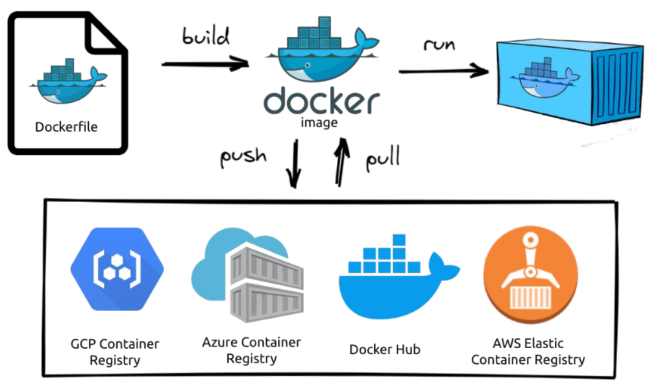
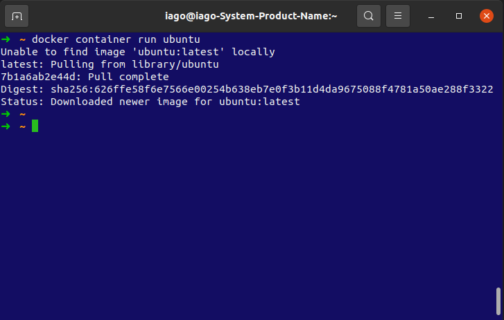
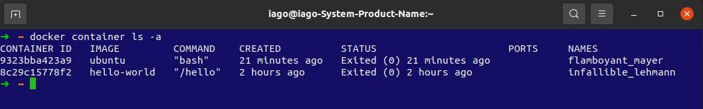
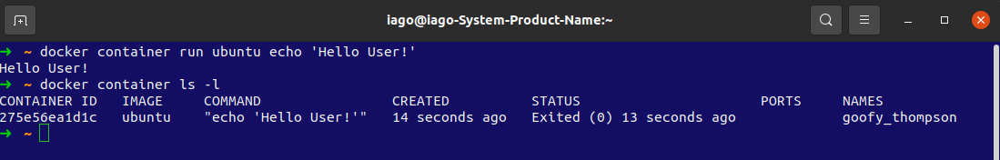

# Docker

`Docker` é um conjunto de produtos de plataforma como serviço, e que usam de virtualização ao nível de sistema operacional para entregar softwares em pacotes chamados contêineres. Sendo criados de forma à isolar um `container` do outro, os contêineres agrupam seus próprios softwares, bibliotecas e arquivos de configuração. Dessa forma, aplicações podem ser disponibilizadas e rodadas em diversos ambientes diferentes, em sistemas operancionais diferentes, pois o local onde elas irão rodar será dentro desse ambiente virtual pré-configurado do `Docker`.

Containers são como "pacotes", entretanto, eles funcionam em uma dinâmica um tanto quanto diferente. Vamos distinguir o que é um `container` e o que é uma `imagem`:

- O `container` é um processo `Docker` que, internamente, possui tudo aquilo que é necessário para seu funcionamento: Sistema Operacional (Binários e Bibliotecas) e recursos necessários para sua aplicação;
- A `imagem` é uma espécie de "fotografia" de um `container`, nós resgatamos uma `imagem`, quando queremos iniciar um novo `container` a partir de uma estrutura já conhecida.

---

# Sumário

- [Configurando a inicialização do Docker](#Configurando-a-inicialização-do-Docker)
- [Containers](#Containers)
- [Imagens](#Imagens)
- [Fluxo Padrão](#Fluxo-Padrão)
- [Esqueleto de um comando em Docker](#Esqueleto-de-um-comando-em-Docker)
  - [Listando containers](#Listando-containers)
  - [Rodando um comando adicional antes de terminar o container](#Rodando-um-comando-adicional-antes-de-terminar-o-container)
- [Comandos do CLI](#Comandos-do-CLI)
  - [Criar e rodar um container](#Criar-e-rodar-um-container)
  - [Cria um container sem executá-lo](#Cria-um-container-sem-executá-lo)
  - [Listar Containers](#Listar-Containers)
  - [Iniciar, reiniciar, pausar, resumir e parar um container](#Iniciar-reiniciar-pausar-resumir-e-parar-um-container)
  - [Retomando o acesso a um container interativo rodando em segundo plano](#Retomando-o-acesso-a-um-container-interativo-rodando-em-segundo-plano)
  - [Excluindo containers específicos](#Excluindo-containers-específicos)
  - [Limpando containers que não estão sendo utilizados](#Limpando-containers-que-não-estão-sendo-utilizados)
  - [Monitorando os processos dentro de um container](#Monitorando-os-processos-dentro-de-um-container)
- [Parâmetros e flags](#Parâmetros-e-flags)
- [Dockerfile](#Dockerfile)
  - [Criando uma aplicação React com Dockerfile](#Criando-uma-aplicação-React-com-Dockerfile)
    - [FROM](#FROM)
    - [WORKDIR](#WORKDIR)
    - [COPY](#COPY)
    - [RUN](#RUN)
    - [Passos intermediários](#Passos-intermediários)
    - [Multi-stage build](#Multi-stage-build)
    - [EXPOSE](#EXPOSE)
    - [CMD](#CMD)
    - [ENTRYPOINT](#ENTRYPOINT)
  - [Gerando uma imagem a partir do Dockerfile](#Gerando-uma-imagem-a-partir-do-Dockerfile)
<!-- - 
- 
-  -->

## Configurando a inicialização do Docker

Para consultar o status do daemon do Docker, execute:

~~~bash
sudo systemctl status docker
~~~

Caso o resultado seja `inactive` ou `stop/waiting` e você queira dar o `start`, execute:

~~~bash
sudo systemctl start docker
~~~

Para habilitar o daemon do Docker para iniciar durante o boot:

~~~bash
sudo systemctl enable docker
~~~

Caso mesmo após isso o Docker não iniciar ou fique dando o seguinte erro ao tentar usá-lo, `docker: Got permission denied while trying to connect to the Docker daemon socket at unix`, execute:

~~~bash
sudo chmod 666 /var/run/docker.sock
~~~

## Containers

`Containers` lembram muito - mas não são - máquinas virtuais*, já que podemos rodar uma aplicação Linux em qualquer ambiente (Windows, Mac ou no próprio Linux) através dele.

    * Máquinas virtuais são softwares que simulam (virtualizam) computadores completos (desde o hardware até o software).

Um `container` não é uma máquina virtual, pois embora compartilhem de mesmas características, o `container` é uma instância isolada (tem apenas uma finalidade) e compartilha dos mesmos recursos do sistema operacional hospedeiro, o que damos o nome de *Virtualização a nível de Sistema Operacional (OS-level virtualization*.

Um `container` não deve ser utilizado para abrigar várias aplicações, e é justamente por isso que ele ocupa muito menos espaço que uma VM. Sua tendência é de manter somente o essencial no seu conteúdo.

---

## Imagens

`Imagens` podem se referir a praticamente qualquer tipo de `container`. Um exemplo disso é pensar o próprio sistema operacional Ubuntu, que possui uma imagem oficial no [Docker Hub](https://hub.docker.com/_/ubuntu).

O `Docker Hub` é o principal repositório de `imagens` `Docker` atualmente. Nele, possuímos o que é chamado de [Registro](https://docs.docker.com/registry/introduction/) (Registry)*, onde requisitamos essas `imagens`.

    * O Registry é um sistema de armazenamento e entrega, no qual podemos ter um usuário com nossas próprias imagens. Algo que lembra muito o GitHub, já que podemos dar pull nessas imagens para uso posterior. Veremos isso mais adiante.

[Voltar ao sumário](#Sumário)

---

## Fluxo Padrão

- Tudo começa em um arquivo chamado `Dockerfile`. Este arquivo possui as instruções necessárias para que possamos gerar uma `imagem`;
  - Aqui vão instruções de qual sistema operacional usar, tal como quais comandos devem ser executados quando a `imagem` for rodada em um `container`.

- Após isso, podemos dar `push` ou `pull` (como em um repositório do GitHub) em uma `imagem` no `Registry`;
  - Você pode dar `pull` na sua própria `imagem` (caso tenha dado push nela) ou em outra a sua escolha.
  - O Registro mais comum é o `Docker Hub`, mas temos outros exemplos, como mostrado na `imagem`.

- Por último, rodamos a `imagem` em um `container`, utilizando o comando run, que veremos mais adiante.
  - Após isso, temos que dizer pro `container` o que deve acontecer, se ele deve se manter ativo ou não, caso o contrário, o `container` é encerrado. O que faz parte de seu ciclo de vida.

[Voltar ao sumário](#Sumário)

---

## Esqueleto de um comando em Docker

Um ponto importante antes de começarmos, é entender que os comandos do `Docker` funcionam no seguinte formato:

~~~bash
docker <comando> <sub-comando> <parâmetros>
~~~

Sendo que é possível abreviar alguns comandos, como no caso do `docker run hello-world`, que também pode ser escrito como `docker container run hello-world`. Utilizaremos aqui a segunda forma, por ser mais atual e verbosa.

Como comentamos anteriormente, o comando `run` serve para rodar uma `imagem` em um `container`, vamos testar isso com a `imagem` oficial do Ubuntu;

O formato do comando para rodar um `container` é o seguinte:

~~~bash
docker container run <nome-da-imagem>:<tag>
~~~

Onde `<tag>` representa a versão daquela `imagem`, caso nenhuma seja passada, ele assumirá que é a última versão disponível (`latest`);

Então rode o comando:

~~~bash
docker container run ubuntu
~~~

Se tudo correr bem, você deve enxergar o seguinte resultado:

Aqui você deve ter notado duas coisas:

1. Uma vez que sua máquina local não possua a `imagem` do registro (`Unable to find image 'ubuntu:latest' locally`), o `Docker` deve se encarregar de baixar essa `imagem`, fazendo o `pull` automaticamente (`latest: Pulling from library/ubuntu`) ;
2. Uma vez que o `Docker` baixou a `imagem` e rodou o `container`, nada aconteceu! 🤔

Na verdade, esse é o comportamento normal! Lembram que comentamos que, se não dissermos para o `container` o que ele deve fazer a seguir, o `container` é simplesmente encerrado?

Pois foi isso mesmo que aconteceu! Um `container` foi criado e iniciado e, uma vez que não demos nenhuma outra instrução pra esse `container`, ele foi encerrado.

[Voltar ao sumário](#Sumário)

---

### Listando containers

No `Docker` é possível saber quais `containers` estão ativos com o seguinte comando:

~~~bash
docker container ls
~~~

Mas no nosso caso, o `container` iniciou e parou logo em seguida, então só é possível enxergar ele se passarmos o parâmetro `-a` para mostrar todos os `containers` incluindo os inativos.

~~~bash
docker container ls -a
~~~

Caso o comando `docker run <imagem>` tenha sido rodado mais de uma vez, para cada uma dessas vezes foi criado um `container`.

Isso significa que o comando `run` também cria um novo `container` para aquela `imagem` toda vez que é executado, mas não se preocupe! É possível remover esses `containers` que não estão sendo mais utilizados, veremos isso mais adiante.

E caso você queira saber somente sobre o último `container` criado (independente do status dele), você pode usar o parâmetro `-l`:

~~~bash
docker container ls -l
~~~

Vamos entender qual o significado de cada coluna:

- `CONTAINER ID`: Identificador único*;
- `IMAGE`: O nome da `imagem` utilizada para a criação do `container` ;
- `COMMAND`: O comando executado/ em execução dentro do `container` ;
- `CREATED`: Quando foi criado o `container` ;
- `STATUS`: O status atual do mesmo, no nosso caso, encerrado;
- `PORT`: A porta que estamos utilizando para nos comunicar com o `container`**;
- `NAMES`: O apelido do `container`, como não definimos nenhum, foi criado um aleatório.

      * Quando executamos algum comando relacionado ao container, podemos nos referenciar tanto pelo campo ID (inteiro ou parte dele), quanto pelo campo NAMES.
      ** Veremos isso mais adiante, mas o docker pode disponibilizar uma porta de acesso para aplicação.
      Para isso, conseguimos fazer uma atribuição de uma porta do sistema hospedeiro, apontando para uma outra porta, no sistema cliente, no formato <porta-do-host>:<porta-do-cliente>.
      Exemplo 8080:3000, em que a porta 8080 do meu sistema representa a porta 3000 do container.

[Voltar ao sumário](#Sumário)

---

### Rodando um comando adicional antes de terminar o container

No `Docker` é possível executar comandos de terminal no `container` antes que ele seja encerrado (sobretudo se quisermos manter ele ativo por mais tempo que o normal).

Para executar comandos no terminal do `container` é só adiciona-los no final da execução do `run`, conforme o modelo:

~~~bash
docker container run <nome-da-imagem>:<tag> <comando> <argumentos-do-comando>
~~~

Exemplo:

~~~bash
docker container run ubuntu echo 'Hello User!'
~~~

[Voltar ao sumário](#Sumário)

---

## Comandos do CLI

### Criar e rodar um container

- Cria um `container` e roda logo em seguida:

~~~bash
docker container run <parâmetros> <imagem>:<tag>
~~~

- O parâmetro `--name` define um `<nome-da-sua-escolha>` para aquele `container` (ao invés de um nome aleatório):

~~~bash
docker container run --name <nome-da-sua-escolha> <imagem>:<tag>
~~~

- O parâmetro `--rm` deve garantir que o `container` seja removido ao final da execução (útil para testar imagens sem ficar acumulando `containers` novos):

~~~bash
docker container run --rm <imagem>:<tag>
~~~

- O parâmetro `-d` (de `--detach`, desacoplado em português) rodará esse `container` em segundo plano:

~~~bash
docker container run -d <imagem>:<tag>
~~~

[Voltar ao sumário](#Sumário)

---

### Cria um container sem executá-lo

- Cria um `container` com a `imagem` de referência, mas não o executa imediatamente:

~~~bash
docker container create <parâmetros> <imagem>:<tag>
~~~

- O parâmetro `-it` nesse contexto, deve garantir que ao iniciar o `container`, ele se mantenha ativo e disponha de um terminal de acesso:

~~~bash
docker container create -it <imagem>:<tag>
~~~

[Voltar ao sumário](#Sumário)

---

### Listar Containers

- Lista (ls, list em inglês) todos os `containers` ativos:

~~~bash
docker container ls
~~~

- Lista todos os `containers` ativos e inativos:

~~~bash
docker container ls -a
~~~

- Lista o último `container` criado (independente do seu estado):

~~~bash
docker container ls -l
~~~

[Voltar ao sumário](#Sumário)

---

### Iniciar, reiniciar, pausar, resumir e parar um container

- Inicia um `container` usando referências de sua identificação única (campo `CONTAINER ID`, parcialmente ou inteiro), ou pelo nome (campo `NAMES`) que foi definido:

~~~bash
docker container start <CONTAINER ID || NAMES>
~~~

Note que o comando `start` difere do comando `run`. O `start` apenas inicia o `container` que já havia sido criado (mas estava inativo), enquanto o `run` cria e executa um novo `container`!

- Reinicia um `container` usando as referências citadas anteriormente:

~~~bash
docker container restart <CONTAINER ID || NAMES>
~~~

- Pausa um `container` usando as referências citadas anteriormente:

~~~bash
docker container pause <CONTAINER ID || NAMES>
~~~

- Tira um `container` do modo de pausa usando as referências citadas anteriormente:

~~~bash
docker container unpause <CONTAINER ID || NAMES>
~~~

- Encerra um `container` usando as referências citadas anteriormente:

~~~bash
docker container stop <CONTAINER ID || NAMES>
~~~

[Voltar ao sumário](#Sumário)

---

### Retomando o acesso a um container interativo rodando em segundo plano

- Caso você tenha iniciado um `container` em segundo plano utilizando `-dit`, você pode acessar esse `container` rodando o comando `attach`:

~~~bash
docker container attach <CONTAINER ID || NAMES>
~~~

[Voltar ao sumário](#Sumário)

---

### Excluindo containers específicos

- Se o `container` não estiver ativo, esse comando deve remover o mesmo:

~~~bash
docker container rm <CONTAINER ID || NAMES>
~~~

- Se o `container` estiver ativo, você deve passar o parâmetro `-f` (forçar) para parar sua execução e depois efetuar a remoção:

~~~bash
docker container rm -f <CONTAINER ID || NAMES>
~~~

[Voltar ao sumário](#Sumário)

---

### Limpando containers que não estão sendo utilizados

- ⚠️ Use com moderação ⚠️: Esse comando deve remover todos os `containers` inativos do seu computador. O comando pede confirmação.

~~~bash
docker container prune
~~~

[Voltar ao sumário](#Sumário)

---

### Monitorando os processos dentro de um container

- O comando top, assim como nos terminais linux, traz as informações sobre os processos que estão sendo rodados, mas dentro daquele `container`, o que não inclui, por exemplo, serviços que são compartilhados com o sistema hospedeiro. Ele é útil para quando estamos os rodando em segundo plano:

~~~bash
docker container top <CONTAINER ID || NAMES>
~~~

[Voltar ao sumário](#Sumário)

---

## Parâmetros e flags

- `-a` - Retorna todos os dados;
- `-d` - Roda um `container` em segundo plano;
- `-f` - Força a execução de algum comando, passando por cima de restrições padrões;
- `-i` - Estabelece uma interface de comunicação física com esse terminal, no caso, por meio do teclado;
- `-l` - Retorna os últimos dados;
- `-p` - Atribui uma porta livre do computador para uma porta do docker;
- `--rm` - Remove um `container` ao final da execução;
- `-t` - Requisita um terminal no `container`, que consiga imprimir o retorno dos comandos;

[Voltar ao sumário](#Sumário)

---

## Dockerfile

Até aqui foi visto que para criarmos `container` precisamos de uma `imagem`, que é uma base para a criação da aplicação. Logo, para criar `containers` específicos para as nossas aplicações, é necessário iniciar criando uma `imagem` deles, para isso podemos usar o `Dockerfile`.

O Dockerfile nada mais é do que um arquivo de configuração usado pelo Docker com a descrição passo a passo do que você deseja que aconteça.

[Voltar ao sumário](#Sumário)

### Criando uma aplicação React com Dockerfile

Por questões didáticas, será feita a `dockerização` de uma aplicação `React`. Não serão feitos incrementos na aplicação, pois o intuito é focar no processo de `dockerização`.

A primeira coisa que faremos é criar um React App, que chamaremos de  `react-dockerized`:

~~~bash
npx create-react-app react-dockerized
~~~

Acessar o diretório da aplicação criada

~~~bash
cd react-dockerized
~~~

Criar um arquivo `Dockerfile` na raiz dessa pasta:

~~~bash
touch Dockerfile
~~~

Unindo os três comandos

~~~bash
npx create-react-app react-dockerized && cd react-dockerized && touch Dockerfile
~~~

A ideia do arquivo `Dockerfile` é que ele é autossuficiente, ou seja, é possível criar e executar uma aplicação toda só por comandos dentro dele. Entretanto, aqui usaremos um pequeno exemplo externo, simulando um cenário que é bastante comum, que é o cenário de desenvolvimento local (onde você terá os arquivos de um projeto dentro de uma pasta no seu computador, onde estará também o seu `Dockerfile`);

Dito isso, vamos começar a editar o `Dockerfile`.

[Voltar ao sumário](#Sumário)

#### FROM

Ao criarmos uma nova `imagem`, sempre devemos baseá-la em uma outra, para isso utilizamos o `FROM`. A estrutura desse comando é a seguinte:

~~~bash
FROM <image-base>:<versão>-<tag> AS <alias>
~~~

No `Dockerfile` do nosso mini-projeto, vamos basear nossa `imagem` no `node:14-alpine` (`NodeJS versão 14` que roda a partir da distro `Alpine`) e dar o `alias` `"build"` para ela:

~~~bash
FROM node:14-alpine AS build
~~~

    A partir do FROM, é possível usar qualquer comando em qualquer ordem, porém, dependendo do funcionamento do seu aplicativo, etapas bem posicionadas podem otimizar o processo de build (que é a construção da imagem), rebuild (reconstrução da imagem) ou mesmo na distribuição. Isso porque quanto menos etapas para aplicação rodar, menos camadas a imagem vai gerar, diminuindo seu peso.
    Isso é importante, principalmente quando estamos trabalhando em uma imagem que recebe atualizações regulares.

É recomendado utilizar sempre uma versão específica de nossa `imagem` base em nossas `imagens` de produção, por exemplo `ubuntu:8` ao invés de `ubuntu:latest`, isso garante que estaremos utilizando sempre a mesma `imagem` base quando `buildarmos` nossa `imagem`, evitando quebras de compatibilidades caso a `imagem` "`latest`" seja atualizada para a `versão 9`, por exemplo.

Outra recomendação é, sempre que possível, utilizar as versões "mínimas" da `imagem`. Por exemplo, imagens com `tag` `slim` ou `alpine`, que são muito mais leves, pois utilizam versões minimalistas do `SO` (como é o caso do `Alpine`) e que possuem menos dependências e ferramentas instaladas.

Consequentemente, pode ser necessário a instalação de alguma ferramenta específica (que normalmente já viria instalada no `SO`) para que nossa aplicação funcione corretamente, porém, isso pode ser feito de maneira simples em nosso `Dockerfile`. Essa prática vale a pena pelos benefícios de se ter uma `imagem` muito mais leve, que pode ser 10 vezes menor.

[Voltar ao sumário](#Sumário)

---

#### WORKDIR

Com o comando `WORKDIR`, pdemos definir um `"diretório de trabalho"`, que será utilizado como base para a execução dos comandos. A estrutura desse comando é a seguinte:

~~~bash
WORKDIR /diretorio/que/sera/utilizado
~~~

Na nossa aplicação, vamos definir o diretório `/app` como nosso `WORKDIR` no `Dockerfile`:

~~~bash
WORKDIR /app
~~~

[Voltar ao sumário](#Sumário)

---

#### COPY

Vimos que conseguimos preparar nossa `imagem` para executar por exemplo, uma aplicação dentro do `container`, porém, precisamos do código fonte para rodá-lo.

Para isso utilizamos o `COPY` (Copiar em português), com ele conseguimos copiar diretórios e arquivos para dentro da nossa `imagem`. A estrutura desse comando é a seguinte:

~~~bash
COPY ["<ARQUIVO_1>", "<ARQUVIO_2>", ..., "<ARQUIVO_X>", "<PASTA-DESTINO>"]
~~~

Imagine que estamos em um diretório que possui uma pasta `app` com o código fonte de uma aplicação, para copiá-la para dentro da `imagem` e conseguirmos executá-la, basta aplicar:

~~~bash
COPY ["./app", "/usr/src/app"]
~~~

Com o comando `COPY` conseguimos montar nossa estrutura do código fonte dentro da `imagem`, porém, para executá-la precisaríamos apontar para o diretório que definimos anteriormente como nosso diretório de trabalho (`WORKDIR`).

Vale ressaltar que no `COPY` tanto a sintaxe na forma `exec` `COPY ["arquivo1", "arquivo2", "./destino"]`, como na shell ``COPY arquivo1 arquivo2 ./destino` são aceitas*.

    * O modo shell é como se você rodasse o comando em um terminal.

No `Dockerfile` do nosso mini-projeto, vamos copiar todos os arquivos que começam com `"package"` (`package.json e package-lock.json`), para nosso diretório atual, a pasta `/app`, usando a forma `exec`:

~~~bash
COPY package*.json ./
~~~

[Voltar ao sumário](#Sumário)

---

#### RUN

O `RUN` (Nesse contexto, rodar, em português - como em `rodar um comando`) irá executar uma lista de comandos durante a criação da `imagem`. A estrutura desse comando é a seguinte:

~~~bash
RUN ["<COMANDO>", "<SUBCOMANDO>", "<PARAMETRO-1>", ..., "<PARAMETRO-N>"]
~~~

O `RUN` é comum para prepararmos a imagem para rodar nossos `apps`, instalando as dependências de uma aplicação. Note que o `RUN` também aceita as formas `shell` e `exec`, assim como o `COPY`.

No `Dockerfile` do nosso mini-projeto, vamos rodar o comando de instalação da nossa aplicação, passando um parâmetro para suprimir mensagens de aviso e facilitar a visualização do processo, quando ele ocorrer:

~~~bash
RUN npm install
~~~

    Aqui é importante frisar, que só é possível fazer esse comando de instalação pois a imagem Node, já possui esses aplicativos internamente.

[Voltar ao sumário](#Sumário)

---

#### ⚠️ Passos intermediários ⚠️

Antes de passar para os próximos comandos, alguns passos intermediários são necessários, como por exemplo, fazer a cópia dos demais arquivos para dentro do `container`, porém, como já rodamos um `npm install`, é interessante criarmos um arquivo chamado `dockerignore` para adicionarmos lá a `node_modules`, de modo que ela não seja copiada.

~~~bash
touch .dockerignore
~~~

E no arquivo `.dockeignore` escreva:

~~~txt
node_modules
~~~

Agora, no `Dockerfile` do nosso mini-projeto, podemos definir a cópia de todos os arquivos apenas com o comando:

~~~bash
COPY . .
~~~

Também devemos adicionar um comando para executar o processo de `build`* da nossa aplicação, no `Dockerfile`:

    * Esses comandos podem variar dependendo da aplicação que você for rodar.
    No nosso exemplo, uma aplicação em React possui um script para gerar uma versão otimizada da página criada, por faremos esse processo aqui.

~~~bash
RUN npm run build
~~~

Para entender esse comando, podemos ir no `terminal` e dentro do diretório de nossa aplicação, rodar o comando para gerar uma `build`:

~~~bash
npm run build
~~~

Você pode notar que na raiz do projeto, foi criada uma pasta chamada `build`. Essa pasta contém uma versão otimizada da sua aplicação `React`.

Essa versão, geralmente, é utilizada para disponibilização da sua aplicação em processos de `deploy` (processo automatizado de disponibilização) e publicação na internet.

Para o nosso exemplo, utilizaremos essa `build` em associação com um servidor `http`, logo a seguir.

[Voltar ao sumário](#Sumário)

---

#### Multi-stage build

Aqui faremos um negócio chamado [multi-stage build](https://docs-docker-com.translate.goog/develop/develop-images/multistage-build/?_x_tr_sl=en&_x_tr_tl=pt&_x_tr_hl=pt-BR&_x_tr_pto=nui), que nada mais é que dividir o script do `Dockerfile` em mais de uma parte.

Então nessa segunda parte, passaremos a definir no `Dockerfile` do nosso mini-projeto os comandos do ambiente de produção, no qual utilizaremos um `servidor HTTP NGINX`.

Como foi dito anteriormente, há uma diversidade de servidores `http` no mercado. Utilizamos o `Apache` no exemplo passado e agora utilizaremos o [Servidor Nginx](https://docs.nginx.com/?_ga=2.118764236.47571039.1645624839-303506568.1645624839&_gac=1.263213566.1645624839.Cj0KCQiA09eQBhCxARIsAAYRiymyPQaBpR60vvMAQJ5ugUsOff39pQSgiTBti6MCzKVEZRm3xfToACoaAmk-EALw_wcB). O `Nginx` é um software de código aberto para servidores web, originalmente utilizado para navegação `HTTP`, mas que atualmente também tem outras funcionalidades mais avançadas.

Agora, vamos definir a imagem de origem do `Nginx`, com o `alias` `"prod"`. Em seguida, iremos copiar as informações da imagem que apelidamos de `"build"` e sua respectiva pasta para o diretório do servidor, como a seguir:

~~~bash
FROM nginx:1.16.0-alpine AS prod
COPY --from=build /app/build /usr/share/nginx/html
~~~

[Voltar ao sumário](#Sumário)

---

#### EXPOSE

Outra característica que é necessária nos atentarmos, é a porta que será utilizada por nossa aplicação dentro do `container`.
Aqui não será diferente, o `container` possui toda uma rede interna para o `container` que veremos mais adiante.
Aqui é necessário sabermos que grande parte dos serviços (sobretudo os da web) disponibilizam uma porta de acesso externo, portanto, precisamos especificá-la com o comando `EXPOSE`. A estrutura desse comando é a seguinte:

~~~bash
EXPOSE <PORTA-DO-APP-NO-CONTAINER>
~~~

Por exemplo, se nossa aplicação executa na porta `3000`, precisamos evidenciar no nosso `Dockerfile`:

~~~bash
EXPOSE 3000
~~~

Uma vez "exposta", configuramos nossa `imagem` para utilizar esta porta.

Por padrão, o `Nginx` usa a porta `80` para executar as aplicações, então, podemos expor esta porta no nosso `Dockerfile`:

~~~bash
EXPOSE 80
~~~

Aqui, vale ressaltar que quando formos rodar um `container` utilizando uma `imagem` que expõe uma porta, precisamos atribuir uma porta do nosso sistema hospedeiro (`host`) que direcionará para a porta do sistema convidado (`guest`).

Fazemos isso com o parâmetro `-p`. A estrutura desse comando é a seguinte:

~~~bash
docker container run \
   -p <PORTA-HOST>:<PORTA-GUEST> \
   <IMAGEM>:<TAG>
~~~

Por exemplo, se temos uma aplicação que serve na porta `80` que está exposta no `Dockerfile` e queremos acessá-la a partir da porta `3000` do `host`, basta executarmos:

~~~bash
docker container run \
   -p 3000:80 \
   --rm \
   -dit \
   yeasy/simple-web:latest
~~~

Após rodar o `container`, basta acessar `localhost:3000` para visualizar o `"Real Visit Results"`.

Ao listar os `containers` em execução com `docker container ps`, podemos ver as portas expostas e seus respectivos `binds`, através do campo `PORTS`.

[Voltar ao sumário](#Sumário)

---

#### CMD

O comando `CMD` (Que vem de `Command Prompt`, ou `Prompt de comando` em português), sempre é executado quando o `container` é iniciado.

É interessante ressaltar que pode acontecer de mais de um `CMD` ser definido em um mesmo `Dockerfile` e, neste caso, **apenas o último** terá efeito.

O `CMD` possui 2 formas: a que vimos até aqui para a execução de comandos `shell` e as para `exec`. A estrutura desse comando é a seguinte:

~~~bash
CMD ["<EXECUTAVEL", "<PARAMETRO-1>", ... , "<PARAMETRO-N>"]
~~~

Vamos ver um exemplo:

~~~bash
CMD ["/bin/echo", "Hello World"]
~~~

Nesse forma, o primeiro argumento é o `executável` e os demais são seus `parâmetros`.

Normalmente utilizamos o `CMD` para executar o comando que irá rodar com o `container`, poderíamos usar como exemplo o `start` de um `app`:

~~~bash
CMD npm start
~~~

Aqui temos mais um ponto de atenção, caso o `container` seja executado passando um comando no `RUN`, o comando passado sobrescreverá o comando definido no `CMD`.

Podemos utilizar o `CMD` no `Dockerfile` do nosso mini-projeto, da seguinte forma:

~~~bash
CMD ["nginx", "-g", "daemon off;"]
~~~

[Voltar ao sumário](#Sumário)

---

#### ENTRYPOINT

Vimos que podemos utilizar o `CMD` para iniciarmos um comando ao executarmos nossos `containers`, como por exemplo para iniciarmos um `app`.

Porém, para esse fim recomendamos utilizar `ENTRYPOINT` (Ponto de entrada em português), pois, diferentemente do `CMD`, o comando não será sobrescrito pelo passado no `RUN` ao executarmos o `container`.  A estrutura desse comando é a seguinte:

~~~bash
ENTRYPOINT ["<EXECUTAVEL", "<PARAMETRO-1>", ... , "<PARAMETRO-N>"]
~~~

Vamos ver um exemplo:

~~~bash
ENTRYPOINT ["/bin/echo", "Hello World"]
~~~

Um ponto de atenção é que ao definirmos um `ENTRYPOINT` , alteramos o comportamento do `CMD` , que ao ser utilizado irá rodar como base para o comando definido pelo `ENTRYPOINT` , apenas como "parâmetros adicionais" à ele, por exemplo:

~~~bash
ENTRYPOINT [ "/bin/echo" ]
CMD [ "Hello World" ]
~~~

Nesse exemplo, será executado no iniciar do `container` `echo Hello World`.

No `Dockerfile` do nosso mini-projeto, vamos substituir a linha que estava com `CMD`, agora passando no nosso `ENTRYPOINT`:

~~~bash
ENTRYPOINT ["nginx", "-g", "daemon off;"]
~~~

[Voltar ao sumário](#Sumário)

---

### Gerando uma imagem a partir do Dockerfile

~~~bash
~~~

~~~bash
~~~

~~~bash
~~~

~~~bash
~~~

~~~bash
~~~

~~~bash
~~~

~~~bash
~~~

~~~bash
~~~

~~~bash
~~~

~~~bash
~~~

~~~bash
~~~

~~~bash
~~~

~~~bash
~~~

~~~bash
~~~

~~~bash
~~~

~~~bash
~~~

~~~bash
~~~

~~~bash
~~~

~~~bash
~~~

~~~bash
~~~
