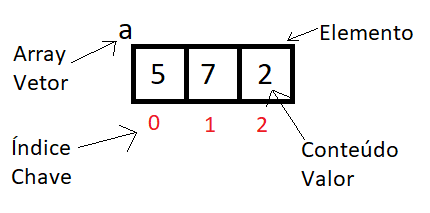

# JS (Java Script)

O JS é responsável pela parte dinâmica da página como efeitos especiais, preenchimento automático de dados, contas, dentre outras coisas. Assim como toda linguagem, JS também possui tipos primitivos das variáveis, tipos primitivos nada mais são do que como são representados os valores de uma variável. Os tipos primitivos mais comuns são Number (Int, Float, Infinity e NaN), String, Boolean, Null, Undefined, Object (Array), Function.

---

## Strings em JS

No JS é possível marcar uma string de 3 formas diferentes, usando aspas simples ou duplas ('', “”), para strings simples, e para interpolar, ou seja, exibir uma variável do meio da string, sem precisar ficar abrindo e fechando a string tem as crases, onde for a variável é só abrir um bloco usando o cifrão e escrever o nome da variável dentro das chaves (`${variavel}` ).

---

## Operadores em JS

Existem muitos tipos de operadores em JS, operadores são sinais que podem desencadear uma ação, ou interferir nela, alguns tipos de operadores são:

    • Aritméticos
      ▪ + Adição
      ▪ - Subtração
      ▪ * Multiplicação
      ▪ / Divisão real
      ▪ % Resto da divisão inteira (Ex: 5%2 = 1)
      ▪ ** Potência

      ◦ Ordem de precedência
        ▪ ()
        ▪ **
        ▪ * / %
        ▪ + -

      ◦ Raiz
        ▪ n**(1/2), só mudar o divisor da fração para mudar a potência da raiz

---

    • Atribuição
      ▪ Atribuição simples, quando um valor ou dado é atribuído a variável. Ex const a = 1;
      ▪ Auto atribuições, quando um valor ou dado é atribuído a uma variável e ela mesma é utilizada para mudar essa atribuição. Ex: let n = 3; let n = n + 5;.
      ▪ Incremento, é uma auto atribuição aumentando o valor de 1 em 1. Ex: let n = 3; let n++;. É a mesma coisa que let n = n + 1;;

---

    • Relacionais
      ▪ > Maior que
      ▪ <  Menor que
      ▪ >= Maior igual
      ▪ <= Menor igual
      ▪ == Igual á
      ▪ != Diferente de
      ▪ ===  Identidade, confere se os valores são iguais em grandeza e tipo (Number, string, boolean,...).
      ▪ !==  Diferente em identidade, confere se os valores são diferentes em grandeza e/ou tipo (Number, string, boolean,...).

      ◦ As respostas das expressões com operadores relacionais serão sempre em tipo booleano, ou seja, true ou false.

---

    • Lógicos
      ▪ ! Negação
      ▪ &&  Conjunção ou “E” lógico
      ▪ ||  Disjunção ou “OU” lógico

    • Ternários
      ▪ ?: É composto por 2 símbolos que aparecem na mesma expressão ?: O nome é ternário pois ele apresenta 3 partes na mesma expressão: Teste ? True : False. Se o teste for verdadeiro, executa o bloco true, se for falso, executa o bloco false.

---

    • Ordem de precedência
      ▪ Aritméticos
      ▪ Relacionais
      ▪ Lógicos

---

## Objetos em JS

Nas linguagens de programação, objetos representam coisas do mundo real, ou mesmo da programação. Ao criarmos um paciente, sabemos que ele deve ter um nome, peso, altura e gordura. Então, agruparemos todas as características em uma mesma variável criando um objeto em JavaScript usando `chaves ({})` . Dentro das chaves, passamos as propriedades do objeto, que nada mais são que as suas características. Para criar uma propriedade, passamos o seu `nome` e o seu `valor` , mas não com igual e sim com dois pontos. Por exemplo, a propriedade `nome: form.nome.value` . Assim, atribuímos às propriedades os valores extraídos do formulário e, no fim, a função retornará o objeto paciente. Para adicionar novas propriedades é só colocar uma vírgula após a propriedade. Para acessar um propriedade específica de um objeto é só escrever o nome do objeto + `.` + nome da propriedade. Ex: `paciente.nome;`

 Também é possível acessar usando colchetes [], esse método deve ser usado quando o nome, ou chave da propriedade, tiver uma string ou um número ou caracteres especiais, nessas condições o não uso dos colchetes implicará em um erro no código, para chamar é simples. Ex:
`paciente['imc calculado'];`

É possível alterar de fora do bloco do objeto os valores das propriedades, declarando o `nome do objeto` + `.` + `chave` = `mudança` . Ex: `paciente.nome = 'Jorge';` . Usando esse mesmo método é possível adicionar uma nova propriedade, caso ela não exista dentro do bloco desse objeto. Para deletar uma propriedade é só usar o operador `delete` seguido da do nome do objeto e a chave. Ex: `delete paciente ['imc calculado'];` .
Ex:

~~~javascript
function obtemPacienteDoFormulario(form) {
  const paciente = {
    nome: form.nome.value,
    peso: form.peso.value,
    altura: form.altura.value,
    gordura: form.gordura.value,
    "imc calculado": imc.value,
  };
  return paciente;
}
~~~

É possível criar uma função que cria objetos de forma automática, ao invés de termos que criar os objetos um por um, é como se ela funcionasse como um molde, onde vamos inserindo os dados e ela vai criando os objetos a partir deste molde.
Ex:

~~~javascript
const robotFactory = (model, mobile) => {
  return {
    model: model,
    mobile: mobile,
    beep() {
      console.log("Beep Boop");
    },
  };
};

const tinCan = robotFactory("P-500", true);
console.log(tinCan);
tinCan.beep();
~~~

Neste exemplo foi atribuído a constante `robotFactory` uma função onde os parâmetros são `model` e `mobile` , esses parâmetros irão ocupar o espaço do valor da propriedades de mesmo nome. Quando a constante `tinCan` é declarada e a constante `robotFactory` é atribuída a ela, são passados 2 argumentos, esses argumentos irão substituir os parâmetros da função e por consequência os valores das propriedades, criando assim novos objetos. O parâmetro da função está ligado ao valor da propriedade e não ao nome da propriedade.

Existem formas de acessar os dados de um objeto, como por exemplo, acessar as chaves `Object.keys();` , os valores `Object.values();` , as chaves e os valores `Object.entries();` , ou somente fazer uma cópia de algum dado de um objeto para um novo objeto `Object.assign();` .

O `Object.keys()` retorna um array cujo os elementos são strings correspondentes para a propriedade enumerável encontrada diretamente sobre o objeto. A ordenação das propriedades é a mesma que a dada pelo loop sobre as propriedades do objeto manualmente. Ex:

~~~javascript
const arr = ["a", "b", "c"];
console.log(Object.keys(arr)); // console: ['0', '1', '2']

// array com objeto
const obj = { 0: "a", 1: "b", 2: "c" };
console.log(Object.keys(obj)); // console: ['0', '1', '2']
~~~

`Object.values()` retorna um array cujos elementos são os valores das propriedades enumeradas encontradas no objeto. A ordem das propriedades é a mesma que a dada pelo laço sobre os valores da propriedade do objeto manualmente. Ex:

~~~javascript
const obj = { foo: "bar", baz: 42 };
console.log(Object.values(obj)); // ['bar', 42]

// array como objeto
const obj = { 0: "a", 1: "b", 2: "c" };
console.log(Object.values(obj)); // ['a', 'b', 'c']
~~~

`Object.entries()` retorna um array cujos elementos são também arrays correspondentes aos pares de propriedades [key, value] enumeráveis encontrados diretamente sobre o objeto. A ordem das propriedades é a mesma que seria se fossem iteradas as propriedades do objeto manualmente. Ex:

~~~javascript
const obj = { foo: "bar", baz: 42 };
console.log(Object.entries(obj)); // [ ['foo', 'bar'], ['baz', 42] ]

// objeto array-like
const obj = { 0: "a", 1: "b", 2: "c" };
console.log(Object.entries(obj)); // [ ['0', 'a'], ['1', 'b'], ['2', 'c'] ]
~~~

O método `Object.assign()` copia apenas propriedades enumeráveis e próprias de um objeto de origem para um objeto destino. Ele usa [[Get]] na origem e [[Put]] no destino, então isto irá invocar getters e setters. Ex:

~~~javascript
const obj = { a: 1 };
const copy = Object.assign({}, obj);
console.log(copy); // { a: 1 }
~~~

Com a evolução do ES algumas funcionalidades foram incluídas no JS, funcionalidades essas que facilitam a construção e a leitura do código deixando ele mais semântico, umas dessas funcionalidades foi a desestruturação ou destructuring, que consiste em acessar as chaves de um objeto sem que seja necessário ficar escrevendo o nome do objeto toda hora e usando um ponto ou um colchete, dessa forma podemos usar o nome do objeto somente uma vez e quando precisarmos do valor de cada chave, usarmos somente o nome da chave, para isso precisamos somente guardar esse valor dentro de uma constante. Ex:

~~~javascript
const obj = { foo: "bar", baz: 42 };

const { foo, baz } = obj;

console.log(foo, baz); // bar 42
~~~

Dessa forma o código fica mais limpo e conciso.

---

## Getters e Setters

Junto com o advento dos objetos e suas propriedades vem certas práticas e metodologias de utilização dos objetos, uma dessas práticas é transforma um objeto em algo que não pode ser alterado, ou no caso não deveria, no ES6 não é possível bloquear a reatribuição de alguma propriedade no código, mas existe a boa prática dos programadores de identificarem as propriedades que não deveriam receber reatribuições permanentes, essa identificação é feita quando um `underline ( _)` é adicionado antes do nome da propriedade, por exemplo:\_nomeDoCliente: `Jorge` . Neste exemplo o nome do cliente foi identificado como sendo uma propriedade que não pode ser mudada na sua fonte, mas isso não significa que ela não possa ser mudada ao longo do código, mas sem alterar a fonte original. Para acessar a informação de uma propriedade e fazer transformações com ela sem que altere o valor original dessa propriedade existe o método `get ()` , o get pode, através de condições feitas no código, retornar diferentes valores para essa propriedade, além de deixar a compreensão do código mais fácil para outros programadores. A declaração do `get` é bem parecido com uma função nominal.
Ex:

~~~javascript
get nomeDoCliente() {
  if (typeof this._nomeDoCliente === 'string') {
    return 'Jorge'
  } else {
    return 'Problemas com o nome do cliente, por favor cheque se o nome foi informado de forma correta'
  }
}
~~~

Neste caso o `get` pegou o valor da propriedade `_nomeDoCliente` e a passou por um teste lógico para verificar se era uma string, mas o teste poderia ser para ver se era um número, ou um resultado booleano, tanto faz, assim como ele poderia ter pego o valor de outra propriedade e ter juntado os 2 valores no momento da exibição. A chamada do `get` não precisa ser feita com o uso do parênteses, é só chamar o nome do objeto + `.` + nome do propriedade que o get recebeu. Ex: `cliente.nomeDoCliente;` .

Existe um outro método que pode ser utilizados para fazer alterações no valor do parâmetro sem que o valor do parâmetro original sofra alterações, basicamente esse método cria uma nova propriedade, baseado na original, onde o valor dessa propriedade pode ser mudado, esse método se chama `set()` . O `set` assim como o `get` funciona como uma função nominal, mas além disso o set também recebe um parâmetro dentro dos seus parênteses, igual a certas funções. O `set` também permite que testes lógicos sejam realizados dentro do seu bloco de função e caso os testes indiquem as condições desejadas atribuir a essa nova propriedade o valor indicado na sua atribuição, essa nova propriedade, na exibição tomará o lugar da propriedade base, mas na fonte, a propriedade original continuará com seu valor inalterado.
Ex:

~~~javascript
set idadeDoCliente(idade) {
  if (typeof idade === 'undefinednumber' && idade >= 0) {
    this._idadeDoCliente = idade
  } else {
    return 'Problemas com a idade do cliente, por favor cheque se a idade informada é um número maior que 0.'
  }
}
~~~

A atribuição de um valor a uma propriedade criada pelo set é normal, igual feito os outros métodos de objeto. Ex: `cliente.idade = 30;` . A sua chamada também é da forma padrão. Ex: `cliente.idade;` . Caso queira a visualização é só coloca-lo no `console.log` ou `document.write` .

---

## Classes em JS

Classes são ferramentas que os desenvolvedores usam para criar objetos de formas rápidas, criando um molde dos objetos, dessa forma as propriedades dos objetos não precisa ser escritas em todos os objetos, um por um. Para criar uma classe é só utilizar a palavra reservada `class` seguida do `nome` para essa classe e chaves `{}` , tudo que estiver dentro dessas chaves farão parte dessa classe. A utilização do método `constructor` é essencial, visto que ele torna possível a criação dos moldes das propriedades, este método aceita parâmetros. Ex:

~~~javascript
class Animal {
  constructor(name) {
    this._name = name;
    this._behavior = 0;
  }

  get name() {
    return this._name;
  }

  get behavior() {
    return this._behavior;
  }

  incrementBehavior() {
    this._behavior++;
  }
}
~~~

Dentro das classes é possível adicionar objetos, métodos, getters e setters.

É possível também criar classes afilhadas, que são classes que recebem propriedades já definidas na classe pai, mas que podem ter em suas classes, propriedades novas e específicas de sua classe, propriedades que não afetam nem estão presentes nas outras classes filhas. Para que seja possível uma classe filha acessar as propriedades da classe pai é necessária uma declaração diferentes da classe. Ex:

~~~javascript
class Cat extends Animal {
  constructor(name, usesLitter) {
    super(name);
    this._usesLitter = usesLitter;
  }
}
~~~

Neste exemplo `Cat` é a classe filha, `Animal` é a classe pai, `extends` faz com que os métodos dentro da classe `Animal` fiquem disponíveis dentro do `Cat` , agora o `Cat` possui um propriedade que `Animal` não possui, que é a `usesLitter` , que será chamada e declarada pelo `constructor` . Já o `super` chama o `constructor` da classe pai, neste caso pedindo somente o valor da propriedade nome do `constructor` da classe pai.

---

## Módulos em JS

Utilizando o JS é uma boa prática dividir as diversas funcionalidades presentes no desenvolvimento de um programa em arquivos diferentes e específicos para cada funcionalidade, trabalhando no terminal ao invés de no navegador é necessário utilizar módulos para que os programas falem entre si, no navegador o próprio HTML faz essa ligação, para isso é necessário abrir um módulo JSON utilizando o comando `npm init` e assim entrar com as descrições e exportar os comandos das outros arquivos usando o comando `export` antes deles, para importar no arquivo principal é só usar `import {o método que você quiser importar} from “endereço do arquivo de onde vira o método”` .

Módulos são pedaços de códigos reutilizáveis que podem ser exportados de um código e importado para outro. Módulos são uteis por várias razões, eles podem ser usados para achar, arrumar e debugar um código, reutilizar ou reciclar a lógica de um código em partes diferentes de uma aplicação, manter uma informação privada e protegida de outros módulos, e mais importante, previne a poluição nos espaços para nomes globais das variáveis. No JS é possível exportar um módulos utilizando a sintaxe `module.exports` e atribuindo como valor a ela, o nome da variável onde está o módulo, que queremos exportar. A criação de um módulo é similar a criação de um objeto. Ex:

~~~javascript
let Airplane = {};
Airplane.myAirplane = "StarJet";

module.exports = Airplane;

console.log(Airplane);
~~~

Existe outra sintaxe que ajuda na hora de importar os módulos, que é a `require()` , esta é uma função que importa os módulos do arquivo original para dentro do arquivo alvo, dessa forma todos módulos de um arquivo ficam disponíveis em outro, sem a necessidade de reescrever o mesmo código. Essa função aceita como parâmetro o endereço do arquivo onde estão os módulos que serão importados, o endereço deve estar entre aspas. No entanto essa função precisa ser atribuída a uma variável, que pode ter qualquer nome, o ideal é que o nome tenha a ver com o que está sendo importado e que seja de fácil entendimento. Ex:

~~~javascript
const Airplane = require("./1-airplane.js");
function displayAirplane() {
  console.log(Airplane.myAirplane);
}

displayAirplane();
~~~

É importante ressaltar que a sintaxe `module.exports` é aceita tanto no ES6 quanto no Node.js, mas no ES6 existe outra sintaxe para fazer a exportação do módulo, mas que não é aceita no Node.js, essa sintaxe é a `export default` , a forma de utilização é bem similar a outra. Ex:

~~~javascript
let Menu = {};
export default Menu;
~~~

Para importação a situação é similar, o `require()` é aceito tanto no ES6 quanto no Node.js, mas existe outra sintaxe que o ES6 aceita na hora de importar, é a sintaxe `import...from...` . A forma de utilização é bem similar a outra. Ex: `import Menu from './menu';` . É uma forma de importação bem específica, importando somente o módulo requisitado.
Exportação nomeada é outro tipo de exportação feita no ES6, nesse caso é possível exportar objetos e funções, somente adicionando seus nomes dentro das `{}` da sintaxe `export` . Ex:

~~~javascript
let specialty = "";
function isVegetarian() {}
function isLowSodium() {}
export { specialty, isVegetarian };
~~~

Existe também a importação nomeada, que é bem parecida com exportação nomeada, essa também só é aceita no ES6, a sua sintaxe é bem similar ao `import...from` , só que dessa forma mais de um módulo pode ser importado ao mesmo tempo. Ex:

~~~javascript
import { specialty, isVegetarian } from "./menu";
console.log(specialty);
~~~

---

## Eventos em JS

Eventos são processos específicos do código que podem ser disparados pela interação com o site.

---

## Funções em JS

São linhas de códigos específicas que só serão executadas quando um evento ocorrer ou forem chamadas dentro do código, e essas linhas estarão dentro de um bloco. Os blocos são delimitados por chaves {}, tudo que estiver dentro das chaves pertencerá a esse bloco.

Os eventos podem ser adicionados nas tag em forma de parâmetros ou podem ser adicionados no JS com o comando .addEventListener(), dentro do parênteses vai o evento.

Uma função precisa ser aberta com `function` e um nome para a ação que esse bloco executará exemplo function acao (), após o parênteses é aberto o bloco. Dentro dos parênteses da ação, podem ou não, serem adicionados parâmetros. Além disso uma função pode retornar um resultado. Ex:

~~~javascript
function acao /*< Nome da função*/(parametro /*< Parâmetro*/) {
  return parametro; /*< Ação*/
  /*^ Retorno da função*/
}

acao(5 /*< Argumento*/);
/*^ Chamada da função*/
~~~

A `Chamada` executa a `Função` , mas a chamada oferece e indica o valor `Argumento` que servirá de base para o `Parâmetro` , dentro dos parênteses, a `Ação` é o que acontece dentro do bloco da função e o `Retorno` é o resultado da função, que pode ser exibido na tela usando um comando de exibição.

A função só pode ter um retorno, que será aquele que se encaixar mais no teste lógico.

Mais de um valor pode ser atribuído a uma função, desde que tenha mais de um parâmetro, e eles devem ser separados por vírgulas.

Os valores passados para uma função quando ela é chamada recebem o nome de `Argumentos` e que podem ser passados em formas de valores ou variáveis. Ex: `listaDeCompras('presunto');` .

A partir do ES6 se tornou possível atribuir aos parâmetros valores padrões, para caso nenhum argumento seja passado na hora de chamar a função, para isso é só declarar um valor ao parâmetro dentro do parênteses da função.
Ex: `function listaDeCompras (item1 = 'leite', item2 = 'pão', item3 = 'ovo'){};` .

Desse jeito mesmo que não seja passado um argumento algo irá aparecer na execução do programa, mas caso seja passado um argumento ele substitui o parâmetro padrão.

Outro tipo de função são as funções de expressão, que são declaradas de forma anônima e dentro de uma variável, elas podem possuir parâmetros declarados ou não, mas os argumentos são passados quando a variável a qual ela está atribuída é chamada, chamada da mesma forma como são passados parâmetros normalmente em funções normais.

Outra forma de declarar uma função é a `Arrow Function` onde ao invés de escrever `function` somente os parâmetros da função são adicionados e após os parênteses são usados o sinal de igual e maior que formando uma seta indicando o inicio do bloco do código. Ex: `let exemplo = (5, 3) => {};` .

---

## Condições em JS

Condições são ocasiões que ocorrem em determinadas ocasiões que preencham pré-requisitos. Existem alguns tipo de condição, os mais usados são `if` e `else` . Condições simples são onde só existem `if` , condições composta são onde existem `if` e `else` , e condições aninhadas são onde existem condições dentro de outras condições. As condições devem ser feitas da seguinte forma: `if (teste) {bloco de código}` , `else {bloco de código}` . Se o teste do `if` for verdadeiro o seu bloco será executado, senão será o do `else` .
Existe uma terceira condição, chamada switch, onde várias condições podem ser declaradas, primeiro é necessária uma variável declarada fora do bloco do switch. O switch é composto da seguinte forma, a declaração do `switch` acompanhado de uma `expressão` , no caso o nome da variável, dentro do bloco são colocados os `case` que possui o valor que será testado (dois pontos no final da linha do case é essencial), um `bloco de código` que será executado caso o teste seja verdade e um `break` que irá finalizar a execução do resto do bloco. Do `case` ao `break` é uma sequência que pode ser reproduzida várias vezes, mas a ultima condição precisa ser um `default` , que também possui um `bloco de código` e um `break` . O `case` é como se fosse um `if` e o `default` é como se fosse um `else` . Ex:

~~~javascript
let fruta = "mamão";
switch (fruta) {
  case "maça":
    console.log("Maçã a 9,49 reais os quilo.");
    break;
  case "mamão":
    console.log("Mamão a 0, 99 reais o quilo");
    break;
  default:
    console.log("Não temos essa fruta no momento.");
    break;
}
~~~

Existem também os operadores ternários, que podem ser usados para substituir um if e else, visto que esse operador testa uma condição e retorna se ela é verdadeira ou falsa. Esse operador é dividido em 3 partes, a primeira parte é o teste, após existe um sinal de `?` que serve para separar a primeira parte da segunda, a segunda parte é o que acontecerá caso o teste seja verdadeiro, após a segunda parte existe um sinal de `:` que separa a terceira parte da segunda, a terceira parte é que acontecerá caso o teste seja falso. Ex:

~~~javascript
// A sintaxe básica do operador ternário é muito simples:
`expressão verdadeira ou falsa` ? `retorno se verdadeira` : `retorno se falsa`;

// Assim, por exemplo, podemos ter expressões com a seguinte estrutura:
const trueExpression = 1 + 1 === 2 ? `isso é verdade` : `isso é mentira`;
console.log(trueExpression); // isso é verdade

const falseExpression = 2 + 2 === 3 ? `isso é verdade` : `isso é mentira`;
console.log(falseExpression); // isso é mentira
~~~

---

## Repetições em JS

Bem parecidos com as condições, mas as repetições além de testarem condições e executarem blocos específicos, elas também repetem esses testes enquanto a condição de repetição for verdadeira. 2 tipos são mais utilizados `while` e `for` . Eles devem ser montados da seguinte maneira: início; while (teste) {bloco de código; incremento}; for (início, teste, incremento) {bloco de código}. Exs:

~~~javascript
let c = 1;
while (c <= 3) {
  c++;
}

for (let c = 1; c <= 3; c += 1) {}
~~~

Os 2 possuem a mesma funcionalidade, a única diferença é que o `while` precisa que o inicio seja antes de dele, o teste é atribuído como parâmetro a ele e o incremento fica dentro do bloco, após o código, já o `for` apresenta o início, o teste e o incremento como parâmetro, depois o bloco de código sem a necessidade do incremento no bloco, pois o incremento já foi definido. Existe também o `forEach` que executa o que estiver dentro do seus parenteses.

---

## Arrays

Arrays, ou variáveis compostas, ou vetores, devem ser capazes de armazenar vários valores em uma mesma estrutura. Variáveis compostas precisam ser declaradas com colchetes [] e vírgula entre os valores. Ex: `const a = [5, 7, 2];` .

Um `Array` ou um `Vetor` é uma variável que possui vários `Elementos` , cada elemento é composto por seu `Valor` e por uma `Chave` de identificação.

O `Elemento` de um `Array` é um par que agrupa no espaço dentro da memória o `Valor` colocado dentro dele e o `Índice` , também é chamado de `Chave` .

O `Índice` é a identificação de cada `Valor` , cada valor fica em um espaço demarcado, o índice faz essa identificação por meio de números começando pelo 0, então o primeiro valor tem índice 0, o segundo tem índice 1 e por ai vai.

O `Valor` é a informação que vai ser atribuída a variável.

Um array pode ter seus valores mudados apenas em um elemento da lista ou na lista toda. Ex: `const a[0] = 9;` .

Neste caso o item 0 da lista, que no caso é o número 5 será mudado para o 9. Ex: `const a = ['números'];` .

Antes da lista que era composta por números agora foi substituída por uma string escrita `números` .

Existem também os Arrays aninhados, que nada mais são que Arrays dentro de outro Array. Ex: `const a = [[2], [5, 7]];` .

Para acessar o número 5 é só chamar da seguinte forma: `a[1][0]` . O primeiro colchete vai identificar se é o array 0 ou 1, e o segundo colchete vai identifica se é o elemento 0 ou 1.

---

## Escopos

Escopo é a ideia de que as variáveis podem ser acessadas de locais diferentes dos códigos, sejam elas locais ou globais. Variáveis de escopos globais se encontram fora de qualquer bloco de código, já as locais estão dentro de um bloco de código. Um bloco de código é delimitado pelas {}, as variáveis globais podem ser acessadas de qualquer lugar do código, as locais só podem ser acessadas dentro do bloco ao qual elas se encontram. Não é uma boa prática nomear variáveis com escopos diferentes com o mesmo nome, pois um erro pode acabar mudando o valor da variavel geral pelo valor da variável local, sem falar que polui o código, atrapalhando a compreensão dele. Não é boa prática declarar todas as variáveis como globais, isso só vai sobrecarregar a memória do computador, variáveis que só serão usadas um blocos específicos do código só devem ser declaradas dentro desses blocos.

---

## Teste unitários em JS

Testes unitários são porções de códigos que servem para validar o comportamento de unidades funcionais de código. Existem diversas bibliotecas de teste disponíveis para JS, mas existe uma biblioteca inerte do JS que se chama `assert` e que realiza os teste que indicarmos. Para acessar essa biblioteca é simples, basta somente usar a propriedade `require()` e passar como string a biblioteca assert. Além disso, é recomendado que essa requisição seja salva em uma const, para que seja mais fácil de acessar durante o código. Ex: `const assert = require('assert');` . Essa biblioteca possui diversas propriedades, dentre elas as propriedades strictEqual(), que confere se o teste é exatamente igual ao resultado esperado, noStrictEqual(), que confere se o teste é diferendo do resultado esperado, deepStrictEqual(), que confere se um array ou objeto é igual ao resultado esperado e notDeepStrictEqual(), que confere se um array ou objeto não é igual ao resultado. Existem outras propriedades dentro dessa biblioteca, para saber mais é recomendado olhar a documentação de assert, mas as propriedades em sua maioria compartilham uma característica estrutural bem parecida, ou seja, elas são construídas de forma similar. Primeiro vem o que você deseja testar e depois o que é esperado desse teste. Ex:

~~~javascript
const assert = require("assert");
const numbers = [19, 21, 30, 3, 45, 22, 15];
assert.strictEqual(typeof numbers, "object");
~~~

---

## High Order Functions (HOFs) em JS

HOFs são funções que recebem outras funções como parâmetro e/ou retornam outra função, por exemplo a função addEventListener(), que recebe como primeiro parâmetro um evento que ela deve esperar e como segundo parâmetro uma função que deve ser executada após esse evento acontecer. O JS possui diversas HOFs nativas da própria linguagem, ou seja, não é necessário que sejam feitas importações de bibliotecas, a exemplo de `map()`, `filter()`, `find()`, `log()`, `table()`, `group()`, `sort()`, dentre outras. A estrutura de um HOF é simples, é uma função que recebe uma função como parâmetro e/ou retorna uma função. Ex:

~~~javascript
const repeat = (number, action) => {
  for (let count = 0; count <= number; count += 1) {
    action(count);
  }
};

repeat(3, (test) => {
  if (test % 2 === 0) {
    console.log(test, "is even");
  }
});
~~~

Neste caso, a função repeat recebe 2 parâmetros, o primeiro parâmetro é o número 3, que será usado como condição de parada do laço for, já o segundo parâmetro é uma função que será chamada pelo action, essa função será chamada depois que a validação do laço for acontecer, e essa função tem como objetivo identificar se o número passado a ela como parâmetro é par, se não for, ela não informa nada. Action que é a chamada da função anônima que irá testar se o número é par ou impar, recebe como argumento o valor do count em cada iteração do laço for, logo `test` que é o parâmetro da função anônima, irá receber o valor de count e esse valor que será testado.

---

## Promises em JS

Promises são bem parecidas com as função já vistas acima, mas existem 3 pontos de destaque das Promises em relação à outras funções: 1º as promises são assíncronas, ou seja, elas tem um espaço especial para sua execução sem que trave o fluxo de outras funções, ou seja, ela pode ocorrer em background, enquanto outras funções realizam seus códigos, e quando a promise estiver concluída, ela retorna seu valor e fica esperando ser usada. 2º as promises tem superpoderes, isto é, funções extras que facilitam o controle do fluxo assíncrono delas mesmas. 3º as promises são construídas de uma forma distinta das funções normais, para criar uma promise é necessário o uso de um construtor.

Para cria uma promise é necessário um construtor, esse construtor é chamado `Promise` e pode ser usado ou não em conjunto com o operador `new` . Um construtor nada mais é do que uma função especial que cria um objeto a partir de uma classe. O construtor Promise recebe 2 parâmetros, o `resolve` e o `reject` e obviamente uma construção de função podendo ser em forma de arrow function. Ex:

~~~javascript
const promise = new Promise((resolve, reject) => {});
~~~

Uma promise possui 3 estados, `Pending` , `Resolved` , `Rejected` . Quando uma promise é executada ela entra diretamente para o estado de pending, que é quando ela sai da fila de execução normal das funções e vai para a sua fila especial. Quando ela retorna ela pode assumir um dos outros dois estados, resolved, caso tudo tenha ocorrido bem, ou rejected, caso tenha ocorrido algum erro. Existe apenas uma pequena diferença entre o resolve/reject e o return : enquanto o return interrompe a execução da função quando é chamado, o resolve/reject não o fazem, por isso é importante utilizar um return antes de um deles quando não se quer que a execução continue (esse pattern se chama `early-return` ). Ex:

~~~javascript
const promise = new Promise((resolve, reject) => {
  const number = Math.round(Math.random() * 11);

  number <= 5
    ? reject(console.log(`Que fracasso =( Nosso número foi ${number}`))
    : resolve(console.log(`Que sucesso =) nosso número foi ${number}`));
});
~~~

O problema dessa construção é que toda vez que o resolve acontece o console.log acontece da forma esperada, mas quando o reject acontece, uma mensagem de error é lançada no console, mas existe uma forma de se livrar desse erro e de gerenciar o fluxo de execução, para isso são usados outros métodos disponíveis dentro das promises, que são o `.then()` e o `.catch()` . `.then()` e `.catch()` são chamados de gestores de fluxo e eles servem para regular o que vai acontecer para cada resolve ou reject. O `.then()` recebe 1 argumento, que é o retorno da função resolve, além disso, sua estrutura é a mesma de uma HOF, ou seja, recebe um parâmetro e uma função, dentro dos seus parênteses. Além disso o `.then()` pode ser usado em cadeia, assim o próximo `.then()` da cadeia vai receber o retorno do `.then()` anterior, esse conceito é chamado de chaining, ou encadeamento. A parte mais importante é que o `.then()` espera a promise (ou o `.then()` anterior) ser concluída para começar a sua execução. Assim, nosso fluxo está controlado. Ex:

~~~javascript
const promise = new Promise((resolve, reject) => {
  const number = Math.round(Math.random() * 11);

  number <= 5
    ? reject(console.log(`Que fracasso =( Nosso número foi ${number}`))
    : resolve(number);
});

promise
  .then((number) => `Que sucesso =) nosso número foi ${number}`)
  .then((msg) => console.log(msg));
~~~

Assim como `.then()` recebe o retorno do resolve, o `.catch()` recebe o retorno do reject, que é passado para ele com um parâmetro para a sua função interna. Da mesma forma que o `.then()` , o `.catch()` também possui uma estrutura de uma HOF, ou seja, recebe um parâmetro e uma função, dentro dos seus parênteses. Diferente do `.then()` o `.catch()` não pode ser encadeado, quando ele ocorre, ele pula todos os `.then()` , além disso um `.catch()` pode pegar o erro de um `.then()` de dentro de um encadeamento. Ex:

~~~javascript
const promise = new Promise((resolve, reject) => {
  const number = Math.round(Math.random() * 11);

  number <= 5 ? reject(number) : resolve(number);
});

promise
  .then((number) => `Que sucesso =) nosso número foi ${number}`)
  .then((msg) => console.log(msg))
  .catch((number) => console.log(`Que fracasso =( Nosso número foi ${number}`));
~~~

Promises são usadas para fazer requisições a uma API, uma das funções mais utilizadas para isso é o Fetch.

---

## Fetch em JS

A função fetch, é responsável por enviar requisições a APIs. Porém, essa não é a sua única responsabilidade. Ela também possui ferramentas para tratar os dados recebidos e devolvê-los, além de lidar com os erros. O retorno da chamada varia conforme o retorno da chamada utilizada, não só em conteúdo, mas também em formato. Visto que o foco aqui é JavaScript, lidaremos com respostas em formato JSON (JavaScript Object Notation) ou respostas que possam ser reformatadas para tal.

A função fetch recebe como parâmetro um endpoint, que pode ser uma URL da API desejada, o fetch também possui acesso as propriedades `.then()` e `.catch()` . Ex:

~~~javascript
const fetch = require("node-fetch");

function verifiedFetch(url) {
  return new Promise((resolve, reject) => {
    if (url === "https://api.chucknorris.io/jokes/random?category=dev") {
      fetch(url)
        .then((result) => result.json())
        .then((result) => resolve(result.value));
    } else {
      reject(new Error("endpoint não existe"));
    }
  });
}

verifiedFetch("https://api.chucknorris.io/jokes/random?category=dev");
~~~

Vamos dar uma olhada rápida no código. Primeiro criamos a função verifiedFetch e passamos o url do nosso endpoint. Depois retornamos uma promise , transformando nossa função em uma função assíncrona. Agora, dentro da promise fazemos uma verificação. Se o endpoint for o certo, usamos o fetch para fazer uma chamada ao endpoint, transformamos a resposta em um json utilizando o método `.json()` , e para finalizar usamos o resolve para retornar a nossa resposta. Caso o url não seja o certo, levantamos um error. Perceba aqui que usamos o construtor new Error para levantar um error. Usar esse construtor dentro do reject é uma boa prática importante e vamos usá-lo a partir de agora.

Como vimos, `verifiedFetch` é uma promise, logo, é assíncrono. Quando o javascript executa a função, ele manda ela para "área especial" e passa para próxima função que é o console. Como a promise ainda não voltou com o conteúdo de `message` , vemos que a promise ainda está no estado pending mesmo sendo resolvida imediatamente. Isso aconteceu pois, mesmo resolvendo na hora, a promise vai para sua área e sai da fila. Quando ela retorna, mesmo que de imediato, ela volta pro final da fila e o console.log está na frente, sendo executado primeiro. Para resolver esse problema existem 2 maneiras. A primeira é usar o fluxo da promise e colocar o console.log dentro do `.then()` . Essa solução e ótima, mas pode ficar difícil de se manter e ler a medida que o número de passos aumenta e a medida que cada passo fica mais complexo também, assim, surgiu a terceira evolução das promises, o async e o await.

O async transforma qualquer função em uma promise, para usá-lo é só colocar a palavra async antes da definição da função, daí é só transformar o que for resolve em return e o que for reject em throw. Ex:

~~~javascript
const fetch = require("node-fetch");

async function verifiedFetch(url) {
  if (url === "https://api.chucknorris.io/jokes/random?category=dev") {
    return fetch(url)
      .then((result) => result.json())
      .then((result) => resolve(result.value));
  }
  throw new Error("endpoint não existe");
}

function sendJokeToFriend(name) {
  const message = verifiedFetch(
    "https://api.chucknorris.io/jokes/random?category=dev"
  )
    .then((joke) => `Oi ${name}, ouve essa: ${joke}`)
    .catch((err) => err);

  console.log(message);
}

sendJokeToFriend("Anna");
~~~

Entretanto, ainda não acabou, junto com o async vem o await, que só pode ser utilizado dentro de uma função async e ela faz exatamente o que o nome dela diz, faz com que a função espere uma resposta para poder continuar sua execução. Ex:

~~~javascript
const fetch = require("node-fetch");

async function verifiedFetch(url) {
  if (url === "https://api.chucknorris.io/jokes/random?category=dev") {
    return fetch(url)
      .then((result) => result.json())
      .then((result) => resolve(result.value));
  }
  throw new Error("endpoint não existe");
}

async function sendJokeToFriend(name) {
  const message = await verifiedFetch(
    "https://api.chucknorris.io/jokes/random?category=dev"
  )
    .then((joke) => `Oi ${name}, ouve essa: ${joke}`)
    .catch((err) => err);

  console.log(message);
}

sendJokeToFriend("Anna");
~~~

---

### Observações

Todas as estruturas vistas são acumulativas, elas podem ser usadas umas dentro das outras.

---

## Comandos e propriedades em JS

- `document.` – O document. é o comando que vem antes de alguns comandos, ele indica que esses comandos vão ser realizados no documento, ou na página, ele pode ser acompanhado de muitos comandos.
- `document.write();`– Escreve o que for atribuído entre parênteses na janela, podendo ser desde strings até números, contas, funções, dentre outros.
- `document.querySelector(“”);` – Seleciona um objeto, podendo ser pela sua class ou id.
- `document.getElementsByTagName(“”)` – Seleciona objetos pelas suas tags.
- `document.getElementById(“”)` – Seleciona um objeto pelo id.
- `document.getElementsByName(“”)` – Seleciona objetos pelos seus nomes.
- `document.getElementsByClassName(“”)` – Seleciona objetos pelas suas classes.
- `alert ();` – Cria um pop-up na tela exibindo a mensagem que estiver entre os parênteses.
- `prompt ()` – Popup onde pode ser escrito algo.
- `confirm ()` – Popup de confirmação, onde existe somente ok e cancela
- `console.log ();` – Exibe no console do navegador o que estiver dentro dos parêntese.
- `var variavel;` – As variáveis são precedidas das palavra `var`, `let` ou `const`, mas `var` caiu em desuso, após o `var` vem o `identificador` ou `nome` da variável, após o `identificador` vem o sinal de `=`, que significa recebe, ou atribui, acompanhado do conteúdo que essa variável vai receber, chamado de `atribuição`. Ex:
  `var titulo = "Exemplo do título";` .
- `let variavel;` – As variáveis precedidas por `let` podem ter seus valores reatribuídos ao longo do código, mas a `let` só pode ser acessada dentro do escopo na qual ele foi criada, blocos de código com o escopo fora de onde ela foi criada, não conseguirão acessar esta variável.
- `const variavel;` - As variáves precedidas por `const` não podem ter seus valores reatribuídos ao longo do código, os seus valores se tornam constantes.
- `variavel.textContent = “Aparecida Nutricionista”;` – O comando textContent, pega o conteúdo de texto dentro da variável ao qual ele está ligado, no caso é a variável `variavel`, e muda pra aquilo que for atribuído a ele, no caso mudou para `Aparecida Nutricionista`.
- `const variavel [];` - Cria um array.
- `variavel.value.length` – Indica o tamanho do que está dentro da variável, pode ser usado para comparações e validações.
- `if () {}` – Cria uma condição `se`.
- `else () {}` – Cria uma condição `senão`.
- `while () {}` – Cria uma laço `enquanto`.
- `for () {}` – Cria um laço `para`.
- `class` – É outra forma de declarar uma variável, mas onde a lista é uma parte dela, ao invés de usar o sinal de `=` para atribuição é usado um `{}` e tudo que estiver dentro será considerado como atributo, que devem ser separados por `;`, a class cria um molde de atributos que podem ser usados em outras variáveis, para isso é preciso atribuir a essa variável a class, usando o comando `new nomeDaClass ()`. Para atribuir um valor ao atributo é só usar o nome da variável `.` o nome do atributo. Exemplo:

~~~javascript
class cliente {
  nome;
}
let cliente1 = new cliente();
cliente1.nome = "Iago";
~~~

- `.classList.add (“paciente-inválido”);` – Cria uma nova class ao objeto que ela estiver ligada, possibilitando assim novas alterações no CSS através dessa nova classe.
- `function acao()` – Cria uma função.
- `return` – Faz o retorno da função, mostrando que ela for atribuído ou finalizando a função.

### HOFs

- `.push()` – Adiciona o valor que estiver entre parênteses ao final da lista.
- `.pop()` – Remove o último item da lista, mas pode retornar o valor do item removido, que pode ser salvo dentro de uma variável.
- `.splice()` – Remove um item do final da lista, mas é necessário dizer em qual posição vai começar e por quantas posições vai se estender. Ex: `lista.splice(2, 1);`. Vai remover o item na posição 2, mas só vai fazer isso com 1 item, se o segundo valor fosse 2 ele iria remover o item na posição 2 e o item na posição 3.
- `.shift()` – Remove um item do início da lista.
- `.unshift()` – Adiciona um item no início da lista.
- `.sort()` – Coloca os valores dentro de um array em ordem, a ordem pode ser escolhida conforme passagem da função callback dentro do sort, para saber mais, verificar a documentação. Para colocar números em ordem, é preciso fazer uma declaração um pouco diferente para o sort, visto que ele usa o unicode como referência padrão, para colocar números em ordem é só usar a seguinte configuração: .sort((a, b) => a - b); .
- `.indexOf()` – Procura o valor dentro do parênteses no array.
- `.map()` – Pega os itens do array, passa pela função callback passada dentro dos seus parênteses e retorna um novo array com os itens retornados da função. A callback do map aceita até 3 parâmetros, o elemento atual sendo processado no array, o index do elemento atual sendo processado no array e o array de origem.
- `.filter()` – Pega os itens do array, passa pela função callback passada dentro dos seus parênteses e retorna um novo array com itens que atendem a condição da callback. A callback do filter aceita até 3 parâmetros, o elemento atual sendo processado no array, o index do elemento atual sendo processado no array e o array de origem.
- `.find()` – Retorna o primeiro item a atender a condição da função callback passada dentro dos seus parênteses, a callback do find aceita até 3 parâmetros, o elemento atual sendo processado no array, o index do elemento atual sendo processado no array e o array de origem.
- `.findIndex()` – Encontra um elemento dentro de um array.
- `.reduce()` – Acumula dentro de si os resultados de uma função, diferente das outras HOFs, a callback do reduce recebe 4 parâmetros, o acumulador, que recebe o retorno da callback a cada iteração, somando ao valor que ele já tinha antes, o elemento atual sendo processado no array, o index do elemento atual sendo processado no array e o array de origem. O acumulador recebe o valor do elemento atual e junta esse valor com o valor que o acumulador já tem, se for números, somando eles, se forem strings concatenando e assim por diante com os outros tipos primitivos. Além disso, a própria função reduce pode receber 2 parâmetros, o primeiro sendo a callback, que pode receber os 4 parâmetros descritos acima, e o valor inicial do acumulador, que pode ser qualquer tipo primitivo ou variável composta.
- `.some()` – Procura se existe algum elemento que atenda a função callback passada dentro dos seus parênteses, retorna o valor em booleano, a callback do some aceita até 3 parâmetros, o elemento atual sendo processado no array, o index do elemento atual sendo processado no array e o array de origem.
- `.every()` – Testa se todos os elementos de um array atendem a função callback passada dentro dos seus parênteses, retorna o valor em booleano, a callback do every aceita até 3 parâmetros, o elemento atual sendo processado no array, o index do elemento atual sendo processado no array e o array de origem.
- `.forEach()` – Percorre um array e executa a função callback passada dentro dos seus parênteses a cada um dos itens do array, essa função não retorna nada, somente executa a função dentro dela. O forEach aceita até 3 parâmetros dentro da callback, o elemento atual sendo processado no array, o index do elemento atual sendo processado no array e o array de origem.

### Métodos e propriedades

- `.value` – Comando que indica o valor do objeto ao qual ele estiver ligado.
- `.length` – Indica o tamanho do objeto ao qual estiver ligado.
- `typeof()` – Mostra qual é tipo primitivo do que estiver entre parênteses.
- `string()` – Converte o que estiver dentro dos parênteses para uma string, existe uma variação, `n.tostring()`, onde n seria o nome da variável que será feita a conversão.
- `Number ()` – Converte o que estiver dentro dos parênteses para número, existe 2 variações, a Number.`parseInt()`, que converte para números inteiros, e a `Number.parseFloat()`, que converte para números reais, mas o `Number()` em si já converte para os 2, ele usa o que for mais conveniente para o momento.
- `Number.isInteger()` – Faz um teste para saber se o que estiver dentro do parênteses é um número inteiro, resposta em booleano.
- `Math.random()` – `Math` é um objeto, `.random()` é um método de `Math`, que seleciona um número aleatoriamente entre 0 e 1.
- `Math.floor()` – Arredonda um número para baixo.
- `Math.ceil()` – Arredonda um número para cima.
- `Math.round()` – Arredonda um número para cima ou para baixo, seguindo a lógica do 5.
- `.toFixed()` – Define quantas casas decimais serão exibidas, para definir é só adicionar o número de casas entre os parênteses.
- `.toUpperCase()` – Transforma o que tiver escrito para maiúsculo.
- `.toLowerCase()` – Transforma o que tiver escrito para minúsculo.
- `.style.backgroundColor = “red”;` – Possibilita a mudança de estilo de dentro do JS, mas não é muito recomendado, a não ser que seja uma mudança específica em um item específico.
- `.addEventListener (“click”, nomeFuncao);` – Adiciona um escutador de evento, que vai executar uma função. Para adicionar o nome da função que vai ser executada é só adicioná-lo depois do evento, separando os 2 por uma vírgula, é a mesma coisa de declarar um novo parâmetro. Além disso, existe também uma forma de declarar uma função anônima, ao invés de declarar o nome como parâmetro, é só declarar a função como parâmetro. Ex: botaoAdicionar.addEventListener ("click",  function() {console.log("Oi cliquei no botão")}); . Dessa forma, o bloco da função fica dentro do evento.
- `.remove()` – Remove o objeto ao qual estiver ligado.
- `.target ()` – Indica o alvo de um evento.
- `.parentNode` – Atribui a consequência do evento ao pai do objeto que foi alvo do evento.
- `.creatElement()` - Cria elementos no HTML através do JS.
- `.reset()` – Reseta o objeto ao qual ele estiver ligado a seu estado inicial.
- `.innerText = “”` – Comando para atribuir e exibir um texto no objeto ao qual ele está ligado.
- `.innerHTML = “”` – Comando que muda o conteúdo do HTML do objeto ao qual ele está ligado.
- `.send ()` – Manda a requisição para o site indicado pelo `.open()`.
- `.trim()` – Remove espaços em branco no inicio e no final das strings.

### Eventos nativos

- `dblclick` – Evento que é disparado com um double click.
- `input` – Evento que pega a informação que está sendo digitada em um campo input.
- `RegExp` – Cria um expressão regular que permite que sejam feitas pesquisas por letras dentro de uma lista, é necessário que esteja dentro de uma variável e que antes dela venha o parâmetro new, e após o RegExp venham os valores. Ex: `const expressao = new RegExp(this.value, "i");`.
  O `i` é de case insensitive, ou seja, não liga se está em maiúsculo ou minúsculo. Para executar esse evento é preciso adicionar o nome da variável, o método `test` e o parâmetro que vai ser analisado. Ex: `expressao.test(nome);` .
- `event.preventDefault();` - Impede que o navegador realize o seu comportamento padrão e o substitua pelo comportamento que será programado pelo JS.
- `this.` – Indica o evento acima dele.
- `mouseon()` – Evento disparado quando o mouse entra no objeto.
- `mousemove()` – Evento disparado no movimento do mouse dentro de um objeto.
- `mousedown()` – Evento disparado no click e segura.
- `mouseup()` – Evento disparado quando solta após o click.
- `click()` – Evento disparado no click simpes.
- `mouseout()` – Evento disparado quando o mouse sai do objeto.
- `setTimeOut ()` – Função que cria um delay para o navegador, fazendo o navegador só executar a função que estará dentro dele depois de um tempo determinado. OBS: o tempo é medido em milissegundos.
- `new XMLHttpRequest ()` – Faz requisições de dados em http para outras páginas, a palavra new é necessária. É necessário ser declarado dentro de uma variável. É necessário que haja um `EventListener` para dar a exibir o que vai ser requisitado, é por isso que o EventListener é adicionado da mesma forma que o `.open` e `.send`, mas com um parâmetro chamado `load` e com uma função que dirá o que fazer com essa informação.
- `.open(“GET”, “http://....”)` – Faz a abertura do site que está sendo requisitado pelo `XMLHttpRequest ()`, é necessário estar ligado a variável ao qual o XML foi atribuído.
- `constructor()` – Cria uma nova instância dentro das classes, é um método que quando chamado permite que novas propriedades seja criadas e sirvam de molde para que elas recebam diversas atribuições. Normalmente usado dentro de uma `class`
- `require()` – Função utilizada para importar os módulos de outro arquivo.
- `module.exports` – Exporta um módulo de um código para outro.
- `export deafult ...` – Exporta um módulo de um código para outro, mas só é aceito em ES6.
- `import ... from ...` – Importa um módulo de código, mas só é aceito em ES6. Com esse comando é possível escolher o módulo específico que se quer importar
