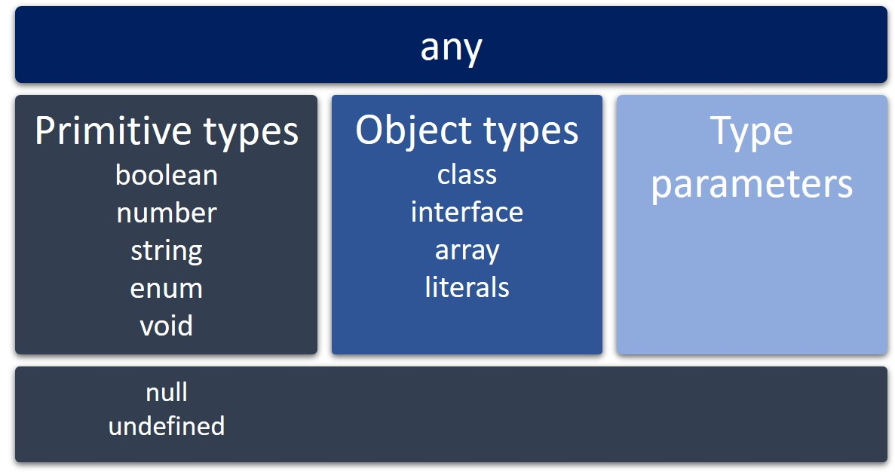

# TypeScript

`TypeScript` é uma linguagem de programação de código aberto desenvolvida pela Microsoft. Ela é um `superconjunto` (superset) do `JavaScript`.

Especificamente, o `TypeScript` é um superconjunto do `ECMAScript 2015`, mais comumente denominado `ECMAScript 6` ou `ES6`. Sendo assim, todo o código `JavaScript` também é código `TypeScript`, e um programa desenvolvido em `TypeScript` pode consumir o `JavaScript` de forma direta.

# Sumário

- [Por que a linguagem TypeScript foi criada?](#Por-que-a-linguagem-TypeScript-foi-criada?)
- [Tipagem](#Tipagem)
  - [Tipagem Estática](#Tipagem-Estática)
  - [Tipagem Dinâmica](#Tipagem-Dinâmica)
  - [Tipagem Forte](#Tipagem-Forte)
  - [Tipagem Fraca](#Tipagem-Fraca)
  - [Inferência do tipo](#Inferência-do-tipo)
- [Diferença entre Compilador e Transpilador](#Diferença-entre-Compilador-e-Transpilador)
- [TSC](#TSC)
- [TSConfig](#TSConfig)
- [Tipos e Subtipos](#Tipos-e-Subtipos)
  - [Tipos primitivos](#Tipos-primitivos)
    - [boolean](#boolean)
    - [number](#number)
    - [string](#string)
    - [void](#void)
    - [null e undefined](#null-e-undefined)
    - [enum](#enum)
    <!-- -  -->
    <!-- -  -->

## Por que a linguagem TypeScript foi criada?

`JavaScript` é, hoje, a linguagem oficial da Web, sendo utilizada para criar aplicações multiplataforma que rodam tanto no navegador quanto em servidores, e até mesmo em dispositivos mobile e `IoT (Internet of Things - internet das coisas)`. No entanto, ela tem uma limitação: não foi concebida para a criação de aplicativos envolvendo milhares ou até mesmo milhões de linhas de código, pois ela não possui alguns dos recursos presentes em outras linguagens.

A linguagem `TypeScript` foi desenvolvida justamente para resolver as limitações do `JavaScript`, sem prejudicar sua capacidade de executar código em todas as plataformas.

[Voltar ao sumário](#Sumário)

---

## Tipagem

O grande recurso do `TypeScript` é o sistema de tipos. Em `TypeScript` podemos identificar o tipo de dado em variáveis, parâmetros ou retornos de funções utilizando a tipagem.

Tipagem, também conhecida como dicas de tipos, é a forma que utilizamos para descrever de qual tipo será o valor de um componente do nosso código - por exemplo: `variáveis`, `expressões`, `funções` ou `módulos`. Isso proporciona uma melhor documentação do código e permite que o `TypeScript` valide se ele está funcionando da maneira correta.

Antes de avançarmos para como o `TypeScript` faz isso, vamos falar um pouco mais sobre tipagem em linguagens de programação.

Podemos categorizar a tipagem em uma linguagem de programação como:

### Tipagem Estática

Não permite que a pessoa desenvolvedora altere o tipo após ele ter sido declarado e, geralmente, a verificação de tipo é feita em tempo de compilação.

A tipagem utilizada na linguagem `TypeScript` tem essa característica.

[Voltar ao sumário](#Sumário)

---

### Tipagem Dinâmica

Está ligada à habilidade da linguagem de programação em "escolher o tipo de dado" de acordo com o valor atribuído à vatiável em tempo de execução - ou seja, de forma dinâmica.

Não há essa característica na tipagem do `TypeScript`.

[Voltar ao sumário](#Sumário)

---

### Tipagem Forte

Linguagens fortemente tipadas não realizam converões automaticamente. Ou seja, não é poss;ivel realizar operações entre valores de diferentes tipos, sendo necessário que a pessoa desenvolvedora faça a conversão de um dos tipos, caso seja possível.

A tipagem utilizada na linguagem `TypeScript` também possui essa característica.

[Voltar ao sumário](#Sumário)

---

### Tipagem Fraca

A tipagem fraca está ligada ã caractrística da linguagem de realizar conversões automáticas entre tipos diferentes de dados - ou seja, operações entre valores de tipos diferentes podem acontecer sem a necessidade de uma conversão explícita de tipo. Porém, o resultado pode não ser o esperado e erros podem ocorrer durante a execução.

Nãi há essa característica na tipagem do `TypeScript`.

[Voltar ao sumário](#Sumário)

---

### Inferência do tipo

Algumas linguagens com `tipagem estática` podem fazer a `inferência` de tipo na declaração de variáveis, mas sem permitir que o tipo seja alterado após a declaração.

O `TypeScript` é uma dessas linguagens. Podemos usar a `inferência de tipo`, mas o compilador apresenta um erro quando tentamos atribuir um valor de tipo diferente à variável. Isso porque ele apenas realiza a inferência do tipo inicial da variável. Depois disso, como a linguagem possui tipagem estática, não é possível alterar o tipo.

Então, TypeScript é uma linguagem `fortemente tipada` e `estaticamente tipada` que possui inferência de tipo.

[Voltar ao sumário](#Sumário)

---

## Diferença entre Compilador e Transpilador

Um `Compilador` é um programa que traduz o código desenvolvido usando uma `linguagem de mais alto nível` (mais próxima dos seres humanos) em um código de um programa **equivalente** de uma `linguagem de mais baixo nível` (mais próxima do processador). Como exemplo temos o `GCC` da linguagem `C` e o `Javac` da linguagem `Java`.

Um `Transpilador` é um programa de sistema que traduz o código desenvolvido utilizando uma `linguagem de mais alto nível` em um código de um programa **equivalente** de uma outra `linguagem de mais alto nível` ou em uma **versão diferente** da mesma linguagem. Como exemplo, temos o `J2CL` que transpila código na linguagem `Java` para a linguagem `JavaScript` ou o `Babel` que transpila código `EcmaScript 6` para `EcmaScript 5`.

Um `Transpilador` também é considerado por algumas pessoas como um tipo de `Compilador` que atua em um **nível mais alto de abstração**. Por isso, muitas vezes você verá pessoas dizendo que o `TypeScript` é uma linguagem **transpilada** por traduzir código `TypeScript` em código `JavaScript`, ambas `linguagens de mais alto nível`.

No entanto, o `Typescript` possui um `Compilador` denominado `TSC (TypeScript Compiler)`, que é responsável por fazer essa tradução. Além disso, a própria documentação da linguagem trata esse processo de tradução do código feito pelo `TSC` como `compilação`.

[Voltar ao sumário](#Sumário)

---

## TSC

O `TSC` é o responsável por realizar a tradução do nosso código `TypeScript` para código `JavaScript`.

O `TSC` também é o responsável por realizar a verificação de tipo no código `TypeScript`.

Para isso, é possível instalar o `TSC` e o suporte ao `TypeScript` via npm, e utilizar o comando `tsc` seguido do arquivo que se deseja compilar e realizar a análise de tipo. Caso não deseje instalá-lo, é possível utilizar o comando `tsc` como um executável `npx`.

Para instalar o compilador `TypeScript` globalmente:

~~~bash
npm install -g typescript
~~~

É possível executá-lo da seguinte forma:

~~~bash
tsc nomeDoArquivo.ts
~~~

Caso decida não instalar e usar o comando `tsc`como executável é só executar o comando:

~~~bash
npx tsc nomeDoArquivo.ts
~~~

**Obs:** A extensão `.ts` é a extensão padrão para os arquivos `TypeScritp`.

Ao rodar este comando, será verificado o conteúdo do arquivo `nomeDoArquivo.ts` e, caso nenhum problema seja encontrado, um novo arquivo será criado com o nome `nomeDoArquivo.js` e contendo o código compilado para `JavaScript`. Caso haja erro, o compilador apontará uma mensagem de erro no terminal e o arquivo `.js` não será gerado.

Para rodar o arquivo gerado utilizando o Node:

~~~bash
node nomeDoArquivo.js
~~~

[Voltar ao sumário](#Sumário)

---

## TSConfig

O que define que um projeto é `TypeScript` é a presença de um arquivo de configuração `TSConfig`. O arquivo `tsconfig.json` possui as variáveis de configuração que definirão como o código será compilado.

**Obs**: A melhor prática para a utilização do `Typescript` em um projeto é instalá-lo como uma `devDependency` por meio do comando `npm i -D typescript` e utilizá-lo por meio do `npx`. Isso garante que todas as pessoas que forem compilar o projeto o façam utilizando a mesma versão do `TypeScript`, e não a versão instalada em suas respectivas máquinas.

É possível criar manualmente o arquivo `tsconfig.json` ou, é possível utilizar as ferramentas que a linguagem fornece para gerá-lo automaticamente, já com as principais configurações. Depois, é possível escolher quais serão utilizadas.

Para gerar o `tsconfig.json` é possível utilizar o tsc. Sim, a ferramenta de compilação da linguagem `TypeScript` também traz essa incrível funcionalidade.

Entre em um diretório vazio de sua escolha e execute um dos seguintes comandos no terminal.

Caso tenha instalado o compilador globalmente em sua máquina:

~~~bash
tsc --init
~~~

Ou caso queira utilizar o `tsc` como um executável `npx`:

~~~bash
npx tsc --init
~~~

Um arquivo `tsconfig.json` será gerado no diretório.

O arquivo gerado traz as principais configurações e um comentário à frente de cada linha dizendo o que aquela configuração em específico faz e quais são os valores aceitos. Além disso, para fechar com chave de ouro, também traz uma URL explicando mais sobre o arquivo `tsconfig.json`.

Agora, vamos conhecer um pouco mais do que já vem configurado no arquivo `tsconfig.json` e o que precisamos configurar para criar nosso primeiro projeto em `Typescript`!

- `module`: especifica o sistema de mõdulo a ser utilizado no código `JavaScript` que será gerado pelo compilador como sendo o `CommoJS`;
- `target`: define a versão do `JavaScript`do código compilado com `ES6`;
- `rootDir`: define a localização raiz dos arquivos do projeto;
- `outDir`: define a pasta onde ficará nosso código compilado;
- `esModuleInterop`: habilitamos essa opção para ser possível compilar módulos `ES6` para módulos `CommonJS`;
- `include`: essa chave vai depois do objeto `CompilerOptions` e com ela é possível incluir na compilação os arquivos ou diretórios mencionados;
- `exclude`: essa chave também vai depois do objeto `CompilerOptions` e com ela é possível excluir da compilação os arquivos mencionados.

Exemplo de um `tsconfig.json` básico:

~~~json
{
  "extends": "@tsconfig/node14/tsconfig.json",
  "compilerOptions": {
    "target": "es2016",                                 
    "module": "commonjs",
    "rootDir": "./",
    "outDir": "./dist",
    "preserveConstEnums": true,
    "esModuleInterop": true,
    "forceConsistentCasingInFileNames": true,
    "strict": true,
    "skipLibCheck": true
  },
  "include":["src/**/*"], /* aqui estamos incluindo todos os arquivos dentro da pasta src */
  "exclude": ["node_modules", "**/*.spec.ts"] /* aqui estamos excluindo a pasta node_modules e os arquivos de teste */
}
~~~

[Voltar ao sumário](#Sumário)

---

## Tipos e Subtipos

Em `TypeScript`, todos os tipos são subtipos de um tipo principal chamado `any`, e este é um tipo que pode representar qualquer valor em `JavaScript`. Os demais tipos são os `tipos primitivos`, `tipos de objeto` ou `parâmetros de tipo`.

### Tipos primitivos

#### boolean

Recebe verdadeiro (`true`) ou falso (`false`)

~~~TypeScript
let yes: boolean = true; // cria uma variável de nome "yes" e diz que o tipo é boleano e o valor é true
let no: boolean = false; // cria uma variável de nome "no" e diz que o tipo é boleano e o valor é false
~~~

---

#### number

Recebe valores numéricos e, assim como no `JavaScript`, todos são valores de ponto flutuante.

~~~TypeScript
// cria uma variável de nome "x" e diz que o tipo é number mas não seta o valor
// isso não funciona com const
let x: number;

let y: number = 0;
let z: number = 123.456;
~~~

---

#### string

Recebe uma sequência de caracteres armazenados como unidades de código `UTF-16 Unicode`.

~~~TypeScript
let s: string
let empyt: string = "";
let abc: string = 'abc';
~~~

---

#### void

Existe apenas para indicar a ausência de um valor, como em uma função sem valor retornado.

~~~TypeScript
function sayHelloWorld(): void {
  console.log('Hello World');
}
~~~

---

#### null e undefined

São subtipos de todos os outros tipos.

~~~TypeScript
let nullValue = null;
let undefinedValue = undefined;
~~~

---

#### enum

Uma `enum` é um nome simbólico para um conjunto de valores relacionados, o que significa que você pode utilizá-la para criar um conjunto de constantes para uso com variáveis e propriedades.

Elas são muito úteis quando temos um conjunto de valores que determinado tipo de variável pode assumir.

Imagine que tem um campo em um banco de dados externo que representa o status da matrícula de uma pessoa estudante em um curso, chamado `StudentStatus`, que é do tipo inteiro e pode conter os números 1, 2 ou 3, que representam respectivamente: **Active**, **Inactive** e **Paused**.

~~~TypeScript
enum StudentStatus {
  Active,
  Inactive,
  Paused
}

let newStudentStatus: StudentStatus = StudentStatus.Inactive;
console.log(newStudentStatus); //saída: 1
~~~

A saída não foi a esperada. Por padrão, uma `enum` é baseada em números. Os valores começam de zero e para cada opção é assinalado um número incrementado por 1, assim como os índices de um array. Portanto, **Active** é 0, **Inactive** é 1 e **Paused** é 2. Para que a `enum` reflita os valores do banco de dados externo, é preciso declarar isso da seguinte forma:

~~~TypeScript
enum StudentStatus {
  Active = 1,
  Inactive,
  Paused
}

let newStudentStatus: StudentStatus = StudentStatus.Inactive;
console.log(newStudentStatus); //saída: 2
~~~

Atribuir o número 1 ao primeiro valor da `enum` já é o suficiente.

Sempre que parte da lógica aceitar um conjunto limitado de valores, é considerável utilizar uma `enum`. Elas tornam o código mais legível e demonstram melhor a intenção de quem codificou, além de ajudar a reduzir os erros causados pela transcrição ou digitação incorreta de valores e facilitar a alterações futuras nos valores.

`Enums` suportam o acesso ao dado em ambos as direções: da chave ao valor e do valor à chave.

~~~TypeScript
enum StatusCodes {
  OK = 200,
  BadRequest = 400,
  Unauthorized,
  PaymentRequired,
  Forbidden,
  NotFound,
}

const ok = StatusCodes.OK;
const indiceOk = StatusCodes["OK"];
const stringBadRequest = StatusCodes[400];

console.log(ok); //saída: 200
console.log(indiceOk); //saída: 200
console.log(stringBadRequest); //saída: BadRequest
~~~

---

[Voltar ao sumário](#Sumário)

---

<!-- ~~~TypeScript
~~~ -->

<!-- ~~~bash
~~~ -->

[Utility Types](https://www.typescriptlang.org/docs/handbook/utility-types.html)
