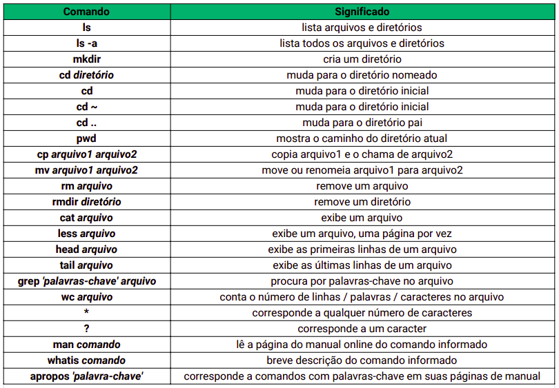
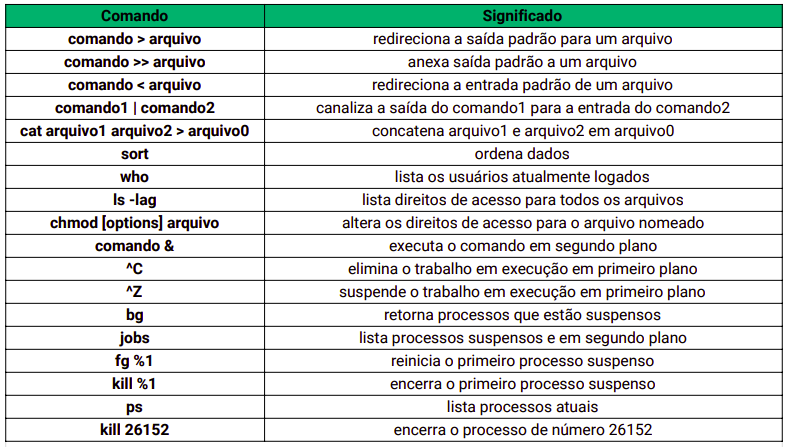
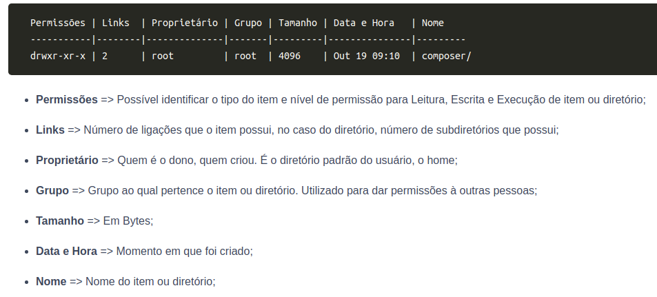

# Unix e Bash

Unix é sistema operacional, pai de quase todos os sistemas operacionais, o Unix é dividido em três níveis, o primeiro nível é chamado de Kernel, que responsável por fazer a interação entre o Hardware e o Software, ele o núcleo do sistema operacional, gerenciando os recursos do sistema, permitindo que os programas façam uso deles, ele já começa a funcionar assim que o computador é ligado, fazendo o gerenciamento de memórias, processos e arquivos. O segundo nível é o Shell, que é a interface entre o SO, usuário e Núcleo (Kernel), o Shell é a primeira interação que temos com o SO quando fazemos o login, ali ele já começa a funcionar, o Shell dos sistemas operacionais geralmente usam uma Command Line Interface (Interface de Linha de Comando) ou uma Graphic User Interface (Interface Gráfica de Usuário), dependendo da função, o Shell lê a linha de comando, interpreta o significado, entender o comando e devolver o resultado pro usuário. O terceiro nível são os aplicativos ou softwares que os usuários instalam no computador e maioria dos comandos do Unix.

No Unix tudo é diferenciado em dois tipos de coisas, processos e arquivos, todos os comandos são processos e cada processo tem um identificador único (PID, Process Indentifier), no Unix tudo são arquivos, diretórios são arquivos, arquivos são arquivos e dispositivos são arquivos. Arquivos são baseados em um sistema de raiz, tem o diretório raiz simbolizado pela /, e dentro dela existem outros diretórios com outros diretórios.

---

## Comandos do Terminal

- `https://ss64.com/`- Link para todos os comandos do terminal.

- `ls` – Lista todos os arquivos e diretórios dentro do diretório atual.
- `ls -a` – Lista todos os arquivos e diretórios, até mesmo os ocultos.
- `ls *` – Lista todos os arquivos dentro dos diretórios filho sem precisar entrar neles.
- `ls ?` – O `?` vira um caractere coringa, ajudando quando não se sabe o nome completo do diretório.
- `cd` – Change Directory, muda de diretório, é só adicionar o comando cd + o nome do diretório que você deseja entrar. Ex: `cd users`
- `cd .` – Referencia a pasta na qual está.
- `cd ..` – Volta para o diretório anterior, diretório pai.
- `clear` – Limpa os comandos e limpa a tela
- `mkdir` – Make Directory, cria um novo diretório, é só adicionar o comando mkdir + o nome que você quer dar ao diretório. Ex: `mkdir trybe`
- `pwd` – Mostra o caminho completo até o diretório.
- `cp` – Faz uma cópia do arquivo que você quiser, é só adicionar o comando cp + nome do arquivo a ser copiado + nome do novo arquivo. Ex: `cp arquivo1.odt arquivo2.odt`
- `cat` – Abre o arquivo e mostra o conteúdo dentro do arquivo. Ex: `cat arquivo1.odt`. O comando cat em sí também consegue receber dados e dar um output desses dados, dependendo de como for usado, pode ser usado para atribuir um dado a um arquivo.
- `mv` – Renomeia ou move o arquivo para outro lugar, adicionando o comando mv + o nome do arquivo a ser movido + caminho até o diretório alvo. Ex: `mv arquivo1.odt /Users/iago/Music`
- `rm` – Apaga um arquivo. Ex: `rm arquivo2.odt`
- `rmdir` – Apaga um diretório, mas o diretório precisa estar vazio. Ex: `rmdir trybe`
- `rm -rf` – Apaga diretórios e arquivos mesmo que o diretório não esteja vazio. Ex: `rm -rf trybe`
- `less` – Exibe parte do conteúdo por páginas, para ir para a próxima página é só apertar a barra de espaço e para sair é apertar Q. Ex: `less arquivo1.txt`. É possível fazer uma busca dentro do arquivo usando / + palavra-chave. Ex: `/toy`.
- `head` – Exibe os 10 primeiros valores do arquivo. Ex: `head arquivo1.txt`
- `head -5` – Exibe os 5 primeiros valores do arquivo. Ex: `head -5arquivo1.txt`
- `tail` – Exibe os 10 ultimos valores do arquivo. Ex: `tail arquivo1.txt`
- `tail -5` – Exibe os 5 ultimos valores do arquivo. Ex: `tail -5 arquivo1.txt`
- `grep` – Pesquisa palavra-chave dentro do arquivo. Ex: `grep Teste arquivo1.txt`
- `grep -i` – Pesquisa palavra-chave dentro do arquivo, mas ignora se está algo em maiúsculo ou minúsculo. Ex: `grep -i ‘teste’ arquivo1.txt`
- `grep -iv` – Exibe todos os valores dentro de um arquivo que não possuem a palavra presquisada. Ex: `grep -iv ‘teste’ arquivo1.txt`
- `wc` – Conta a quantidade de linhas, palavras e caracteres que um arquivo tem. Ex: `wc arquivo1.txt`
- `wc -w` – Conta a quantidade de palavras.
- `wc -l` – Conta a quantidade de linhas.
- `wc -c`– Conta a quantidade de caracteres.
- `man` – Acessa o manual do comando. Ex: `man ls`
- `whatis` – Mostra o que o comando faz. Ex: `whatis cp`
- `apropos` – Mostra quais comandos estão relacionadas a ação que você precisa. Ex: `apropos copy`.
- `find . -name “*.txt”` – Você pode procurar entre múltiplos arquivos com um formato comum como por exemplo .txt, que pode ser útil em algumas buscas. Isso irá listar todos os arquivos .txt iniciando pela pasta atual.
- `find . -name "meu-arquivo" -delete` – Se você quer encontrar um determinado arquivo pelo nome e removê-lo. Utilize o argumento -delete após o nome.
- `>` – Atribui um valor a um determinado arquivo. Ex: cat > cores.txt. O que for digitado depois, será adicionando ao arquivo cores.txt. Também é possível juntar múltiplos arquivos em um arquivo só. Ex: `cat cores.txt frutas.txt > tudo.txt`. Assim, tudo.txt irá conter todos valores que existiam nos arquivos cores.txt e frutas.txt.
- `>>` - Edita os valores de um arquivo, adicionando novos valor. Ex: `cat >> cores.txt`. Os novos valores serão adicionados ao arquivo
- `sort` – Faz um output dos dados em ordem alfabética.
- `|` – Junta dois comandos, fazendo com que o comando um tenha um output dentro do segundo comando. Ex: `who | sort`. Ele mostra quem está usando o terminal, em ordem alfabética.
- `who` – Mostra quem está utilizando o sistema.
- `chmod` – Altera as permissões de acesso para o arquivo nomeado. Ex: `chmod u-rw arquivo.txt`. Dessa forma tira a permissão do usuário de ler e escrever o arquivo. Existem gatilhos para a execução de remover (-), acrescentar (+) ou manter (=) as permissões, assim como existem gatilhos para definir para quem serão as mudanças, usuário atual (u), grupo de usuários (g), outros usuários (o), que não sejam o atual, e todos os usuários (a).
- `ps` – Mostra os processos acontecendo, em background ou não.
- `sleep` – Coloca em delay o processo pelo tempo que você determinar. Ex: `sleep 5`.  Dessa forma o processo vai demorar 5 segundos para acontecer. Ctrl + z para o sleep. Ctrl + c mata o processo de sleep, se ele não estiver em backgound.
- `fg` – Continua um processo que foi parado. Ex: `fg %1`. O processo número 1 será continuado de onde ele parou, o número depois da porcentagem indica qual processo é, esse número pode ser conseguido através do comando ps.
- `jobs` – Mostra os processos em background.
- `kill` – Mata o processo que você quiser, mesmo que ele esteja em background. Ex: `kill %1`. Dessa forma ele vai matar o processo número 1, o número depois da porcentagem indica qual processo é, esse número pode ser conseguido através do comando ps, assim como número PID, que também pode ser usado para matar o processo. Ex: `kill 7657`.
- `kill -9 PID` – Mata os processos que se recusam a morrem com o kill normal. O PID no final deve ser substituído pelo PID do processo, o PID ode ser conseguido através do comando ps.
- `touch` - Cria um arquivo novo. Ex: `touch file.txt`.
- `touch file{01..20}.txt`- Cria arquivos em sequência seguindo a ordem dos números dentro das chaves.

É possível alterar as permissões no modo literal (caracteres), mas também é possível usar o modo octal. Para compreendermos esta outra forma, precisamos entender que eles são administrados por meio de valores como descrito abaixo:

- Diretório d
- Leitura r - 4
- Escrita w - 2
- Execução x – 1

Esses valores são permissões com base em bits de ligados = 1 e desligados = 0,

- rwx = 111 ( 7 | Acesso Total )
- r-- = 100 ( 4 | Somente Leitura )
- -w- = 010 ( 2 | Somente Escrita )
- --x = 001 ( 1 | Somente Execução )
- rw- = 110 ( 6 | Somente Leitura e Escrita )
- r-x = 101 ( 5 | Somente Leitura e Execução )
- -wx = 011 ( 3 | Somente Escrita e Execução )
- --- = 000 ( 0 | Todos Acessos Negados )

Por tanto cada vez que você liga a chave de leitura, atribui-se o valor para esta chave somando-se com as demais chaves de administração de escrita e execução, caso você também deseje liga-las. A sintaxe para realizar esta alteração continua a mesma que do modo literal, sendo chmod 766 [arquivo ou diretório] . Cada número corresponde aos grupos de usuário, de grupo e de outros usuários.

Sobre o comando FIND: O find é um comando para pesquisar em diretórios por arquivos ou outras pastas, de acordo com os parâmetros passados a ele. Esses parâmetros podem ser name , date , size e type . Caso nenhum atributo seja passado, ele pesquisará tudo que estiver dentro do diretório atual. Veja abaixo alguns exemplos de como usá-lo:

- Para listar todos os arquivos que terminam em .txt
  - `find . -name "*.txt"`

- Localizar tanto arquivos quanto diretórios
  - `find ./teste -name exemplo*`

  - Resultado
    - `./teste/exemplo.txt`
    - `./teste/exemplo`

- Localizar somente arquivos
  - find ./teste -type f -name "exemplo*"

  - Resultado
    - ./teste/exemplo.txt

- Localizar somente diretórios
  - `find ./teste -type d -name "exemplo*"`
  - Resultado
    - `./teste/exemplo`

Sobre o comando HISTORY: O `history` é um comando que mostra o histórico de comandos que você executou no terminal. A quantidade ou o tamanho desse _"histórico"_ podem ser configurados para um número arbitrário de comandos ou para ver todo o histórico.

- Mostra o histórico de comandos
  - `history`

- Pegar os últimos 10 comandos
  - `history | tail`

Sobre o comando ECHO: O `echo` é um comando utilizado em scripts ou no terminal para exibir mensagens na tela ou em um arquivo.

- `echo "Este é um teste"`
  - Result
    - `Este é um teste`

Pode ser usado para colocar textos dentro de arquivos.
echo

- `"Este é mais um teste" > teste.txt`

- `cat teste.txt`
  - `Este é mais um teste`
